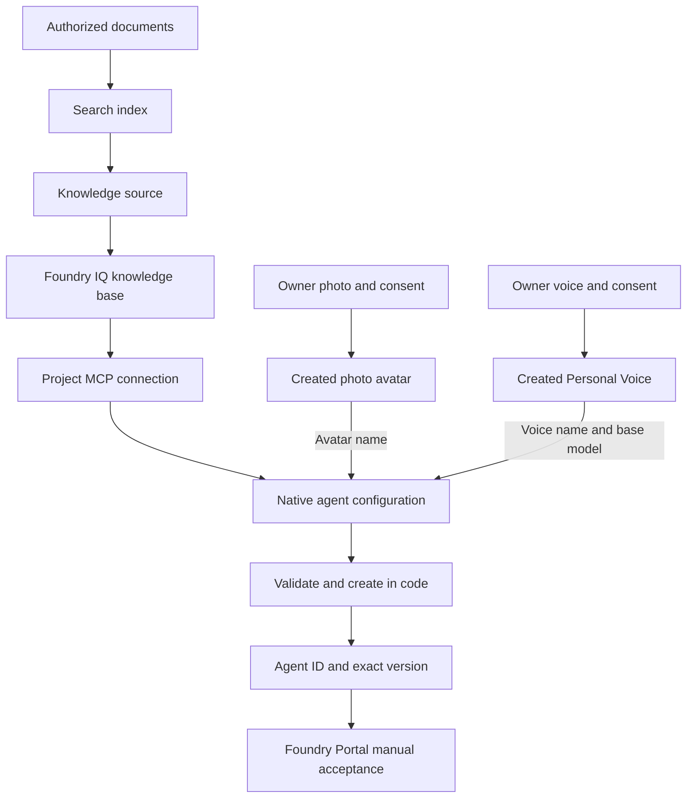

# Create a Foundry agent with Knowledge IQ, custom photo avatar, and Personal Voice

A creation-first walkthrough: prepare **Foundry IQ**, create your own **photo avatar** and **Personal Voice** with consent, configure a native agent in code, obtain its identifiers, and hand off to **Foundry Portal**. No local UI, audio-device library, hosted container, or browser proxy is required by the creator.

> **Validation status:** the sample owner has confirmed completing the **Knowledge + Personal Voice + custom photo-avatar workflow in Foundry**. The creator also passes its offline SDK and CLI checks. See [recorded results](docs/evaluation.md) for the distinction between owner-confirmed manual acceptance and automated tests. The creator never silently substitutes standard assets.

The previously validated [public Voice Live browser sample](../voice-live-foundry-iq-avatar/README.md) remains separate and unchanged at runtime. It uses Ava and built-in Lisa, not Personal Voice or a user's photo.

## Workflow and outputs



| Step | Output to retain locally | Acceptance gate |
| --- | --- | --- |
| Prepare Foundry | Project endpoint; project ARM resource ID; model choice | Correct project, subscription, region, and access |
| Create Knowledge IQ | Index, source and KB names; KB MCP URL | Retrieval returns the ingested content |
| Connect Knowledge | Project connection name and returned resource ID | Project identity can retrieve through that connection |
| Create photo avatar | Custom photo-avatar name for `character` | Consent accepted; asset `Succeeded`; independent preview succeeds |
| Create Personal Voice | Runtime Personal Voice name; base model; separate management/consent/profile IDs | Creation `Succeeded`; runtime name verified through supported Voice Live tooling |
| Configure personal assets | Native voice/avatar fields in local JSON | Local validation and SDK serialization; not a live acceptance result |
| Create selected agent | Agent ID, name, version ID and version | Exact-version read-back matches the requested configuration |
| Open Portal | The same agent selected in the same project | Manual interaction; not inferred from creation |

Do not upload private material or provision resources until their owner approves the destination, cost, permissions, and retention. Do not commit real configuration, consent media, profile IDs, or agent output files.

## 1. Prepare Foundry and install the creator

Use a Foundry project, not a hub-based project. Follow [subscription setup](../../setup_subscription.md) for the project endpoint and ARM ID. These are different values:

- Project endpoint: `https://<account>.services.ai.azure.com/api/projects/<project>`.
- Project ARM ID: `/subscriptions/<subscription>/resourceGroups/<group>/providers/Microsoft.CognitiveServices/accounts/<account>/projects/<project>`.
- `model_type="managed"`: a service-managed model such as `gpt-realtime`.
- `model_type="self_deployed"`: `model` names a deployment in your project.

Confirm the selected region/subscription supports the intended voice and avatar capabilities. Native voice agents are preview; availability does not imply every personal-asset combination is supported.

### Permissions

| Identity | Permission/role | Purpose |
| --- | --- | --- |
| Creator | Foundry User on the appropriate Foundry scope | Create/read agents and use models |
| Connection administrator | Foundry Project Manager, or equivalent connection-write access | Create the project MCP connection |
| Knowledge administrator | Search Service Contributor | Create index, source and KB definitions |
| Document uploader | Search Index Data Contributor | Upload authorized documents |
| Foundry project's managed identity | Search Index Data Reader on Search | Runtime knowledge retrieval |
| Role administrator | Owner or User Access Administrator, or equivalent role-assignment access | Assign only the required roles |

Older interfaces can still display the former Azure AI role names. Search must allow Microsoft Entra/RBAC access. A knowledge base using an LLM also needs the documented model access for its Search identity; the minimal extractive example below has no separate KB LLM. Wait for role propagation before diagnosing an authorization error as a payload error.

### Dependencies

Use Python 3.10+ and a new isolated environment; the recorded run uses Python 3.13 in WSL Ubuntu. Do not replace dependencies in the working browser sample's environment. In WSL, open the repository through its `/mnt/c/...` path. Run the following from `VoiceAgent`, choosing an unused environment path:

```bash
VENV="$HOME/.venvs/create-agent-with-iq-avatar-voice"
if [ -e "$VENV" ] || [ -L "$VENV" ]; then
  printf '%s\n' 'Choose a new environment path; do not overwrite an existing environment.'
else
  python3.13 -m venv "$VENV" &&
  env -u PIP_EXTRA_INDEX_URL -u PIP_INDEX_URL PIP_CONFIG_FILE=/dev/null \
    "$VENV/bin/python" -m pip install --index-url https://pypi.org/simple \
    -r samples/create-agent-with-iq-avatar-voice/requirements.txt
fi
```

After a successful installation, use that environment for every command:

```bash
source "$VENV/bin/activate"
python -m pip check
cd samples/create-agent-with-iq-avatar-voice
python -c 'import create_agent; create_agent.require_sdk()'
python create_agent.py --help
```

For an existing installation of this sample, activate its verified environment and skip creation/install. Do not substitute the browser environment or an older Projects SDK.

The requirements use the **bundled** `azure-ai-projects` 2.7.0b1 build, not an arbitrary PyPI package with the same version. Its source commit and checksum are in [dist/README.md](../../dist/README.md). No `[realtime]` extra, PyAudio, or `azure-ai-voicelive` is needed. Transitive dependencies resolve from that wheel's metadata; this requirements file is not a fully frozen transitive lock.

Sign in through Azure CLI or another supported `DefaultAzureCredential` identity before cloud commands. `validate` needs neither sign-in nor an Azure connection. The CLI does not load or rewrite `.env` files.

## 2. Create Knowledge IQ

Foundry IQ is the knowledge layer, not a separate language model. In this example, Azure AI Search stores the content, a knowledge source describes the index, and a knowledge base exposes retrieval over MCP.

### 2.1 Select and prepare content

Start with the repository's [public voice-agent overview](../sample_foundry_iq_doc/voice-agent-overview.md). Split it by meaningful headings into short documents with `id`, `title`, `content`, and `source_url`. Use the public source link for `source_url`; retain section titles for evaluation.

For your own files, verify ingestion rights first. Remove duplicate OCR, recurring headers/footers, empty pages and tables of contents; preserve page/section references. Do not ingest private evaluation answers as knowledge just to improve a benchmark.

### 2.2 Create an index, upload content, then create the source and KB

Use fresh, dedicated names such as `create-agent-demo-index`, `create-agent-demo-source`, and `create-agent-demo-kb`. Inspect each name first. The following REST payloads are **owner-executed setup examples**, not commands run by the creator. A PUT can replace an existing definition; do not reuse an unknown resource name.

Use the Azure AI Search REST API `2026-08-01-preview` and a locally obtained Search-scoped Entra token. Never save the token in the agent JSON. Send JSON with `Content-Type: application/json` and `Authorization: Bearer <search-token>` to the endpoints below. These preview retrieval settings are not covered by an SLA.

Create the index with `PUT https://<search>.search.windows.net/indexes/create-agent-demo-index?api-version=2026-08-01-preview`:

```json
{
  "name": "create-agent-demo-index",
  "fields": [
    {"name": "id", "type": "Edm.String", "key": true, "filterable": true},
    {"name": "title", "type": "Edm.String", "searchable": true, "retrievable": true},
    {"name": "content", "type": "Edm.String", "searchable": true, "retrievable": true},
    {"name": "source_url", "type": "Edm.String", "retrievable": true}
  ],
  "semantic": {
    "configurations": [{
      "name": "default",
      "prioritizedFields": {
        "titleField": {"fieldName": "title"},
        "prioritizedContentFields": [{"fieldName": "content"}]
      }
    }]
  }
}
```

Upload the prepared content with `POST .../indexes/create-agent-demo-index/docs/index?api-version=2026-08-01-preview`. This example summarizes one section; ingest the other relevant sections before using the full evaluation matrix.

```json
{
  "value": [{
    "@search.action": "upload",
    "id": "overview-lifecycle",
    "title": "Voice Agent: lifecycle and optional storage",
    "content": "Native voice agents use immutable versions. Conversation storage is optional and off by default; enabling it can retain transcripts, tool events, and audio.",
    "source_url": "https://github.com/Azure-Samples/Cognitive-Speech-TTS/blob/master/VoiceAgent/samples/sample_foundry_iq_doc/voice-agent-overview.md"
  }]
}
```

Inspect **every document's indexing status**, not just the HTTP status. Verify the indexed count and content in Search Explorer before continuing.

Create the knowledge source with `PUT .../knowledgesources/create-agent-demo-source?api-version=2026-08-01-preview`:

```json
{
  "name": "create-agent-demo-source",
  "kind": "searchIndex",
  "searchIndexParameters": {
    "searchIndexName": "create-agent-demo-index",
    "semanticConfigurationName": "default",
    "sourceDataFields": [{"name": "title"}, {"name": "content"}, {"name": "source_url"}],
    "searchFields": []
  }
}
```

Create the knowledge base with `PUT .../knowledgebases/create-agent-demo-kb?api-version=2026-08-01-preview`:

```json
{
  "name": "create-agent-demo-kb",
  "description": "Public voice-agent overview for the creation walkthrough.",
  "knowledgeSources": [{"name": "create-agent-demo-source"}],
  "outputMode": "extractiveData",
  "retrievalReasoningEffort": {"kind": "minimal"}
}
```

This keyword/semantic baseline does not configure embeddings or a separate KB planning/synthesis model. If you choose vector retrieval or higher reasoning, provision and authorize the required deployments and record that change; results are no longer the same configuration.

Test retrieval using the Knowledge interface/knowledge-base retrieval API and an answerable question before wiring the agent. Retain this MCP URL locally:

```text
https://<search>.search.windows.net/knowledgebases/create-agent-demo-kb/mcp?api-version=2026-08-01-preview
```

See [knowledge-base creation](https://learn.microsoft.com/en-us/azure/search/agentic-retrieval-how-to-create-knowledge-base) and [search-index knowledge sources](https://learn.microsoft.com/en-us/azure/search/agentic-knowledge-source-how-to-search-index).

### 2.3 Create the project MCP connection

The runtime uses the **project's managed identity**, not a short-lived token embedded in the agent. Enable that identity and have the resource administrator assign Search Index Data Reader on the Search service.

Following [Connect agents to Foundry IQ](https://learn.microsoft.com/en-us/azure/foundry/agents/how-to/foundry-iq-connect), use an ARM-scoped token and a project-level connection:

```http
PUT https://management.azure.com/<project-resource-id-without-leading-slash>/connections/<connection-name>?api-version=2025-10-01-preview
Authorization: Bearer <management-token>
Content-Type: application/json
```

```json
{
  "name": "<connection-name>",
  "properties": {
    "authType": "ProjectManagedIdentity",
    "category": "RemoteTool",
    "target": "https://<search>.search.windows.net/knowledgebases/create-agent-demo-kb/mcp?api-version=2026-08-01-preview",
    "audience": "https://search.azure.com/",
    "isSharedToAll": true,
    "metadata": {"ApiType": "Azure"}
  }
}
```

Confirm that sharing the connection with project users is appropriate before applying this example. Read back the connection's scope, target and authentication. Retain its returned resource ID for administration; the **connection name** is used as `project_connection_id` in the documented agent configuration. Do not interchange it with a KB name, agent ID, or Search URL.

The repository's [IQ provisioner](../../skills/provision-foundry-iq/scripts/provision_foundry_iq.py) is useful reference code, but is **not executed by this sample**. It uses a different, account-scoped connection payload/API and can retrieve keys, assign roles, update definitions, and remove stale documents. Its `--dry-run` performs Azure reads. Do not invoke it against unknown resources or assume its returned ARM ID can be pasted into this template. The [existing browser provisioner](../voice-live-foundry-iq-avatar/src/voice-live-foundry-iq-avatar/provision_kb.py) illustrates the minimal Search payloads but does not create this project connection.

## 3. Create your photo avatar

This step is independent of your knowledge corpus. Use your own likeness, or a person whose explicit authorization and required consent you hold; do not assume a public image grants all required rights.

1. Obtain the required limited access through the [photo-avatar prerequisites](https://learn.microsoft.com/en-us/azure/ai-services/speech-service/text-to-speech-avatar/custom-photo-avatar-create) and [access application](https://aka.ms/customneural).
2. Prepare a clear forward-facing photo with the face visible, typically shoulders-up, without occlusion or heavy shadows.
3. Prepare the prescribed **consent video from the same person**. Follow the exact current consent statement and recording requirements in the official workflow; do not synthesize or bypass consent.
4. In the documented Foundry workflow, navigate through **Build → Fine-tune → AI Services → Fine-tune → Azure Speech - Text to Speech Avatar → Photo avatar**. Labels can change; use the linked guide if the surface differs.
5. Upload/select the photo, register the consent video, review the acknowledgement, and submit. Wait until the created asset reports **Succeeded**.
6. Retain the **custom photo-avatar name** assigned during creation; this is the documented value for `character`. Test that name through **Try Voice Live / Open in Playground** and verify the expected likeness. Keep the resource/region and management identifiers in private notes, not the public template.

Use the supported Speech/Foundry resource for the runtime; confirm regional availability and resource association before creation. Do not assume an asset in a different resource is visible. If necessary, use a documented asset-copy flow with separate authorization.

That preview validates the asset in its supported playground—not a native agent using it. There is no photo upload or consent-media field in this sample's native definition. A video background `image_url` is **not** the person's source photo.

**Custom photo versus custom video:** this sample implements the photo-avatar configuration path (`photo_avatar`, `vasa-1`). A [trained custom video avatar](https://learn.microsoft.com/en-us/azure/ai-services/speech-service/text-to-speech-avatar/custom-avatar-create) has a separate consent, training-data, training and deployment workflow, including ongoing deployment charges. It is not enabled by this creator. Neither path is equivalent to the separate browser sample's built-in Lisa.

## 4. Create your Personal Voice

Azure standard voices are prebuilt. Custom Voice is a distinct training/deployment workflow. **Personal Voice** uses consent and a short recording to create a synthesis profile; selecting Ava is not Personal Voice.

1. Confirm Personal Voice access for the Speech/Foundry resource and create a Personal Voice project using the [official project workflow](https://learn.microsoft.com/en-us/azure/ai-services/speech-service/personal-voice-create-project). In Foundry, select **Fine-tuning → AI Service → Fine-tune**, choose **Azure Speech - Text to Speech**, set **Type: Personal voice**, and enter the name, description and language. Continue to **Register voice talent**. For REST, create `/customvoice/projects/<project-id>?api-version=2026-01-01` with a PUT body containing `"kind": "PersonalVoice"` and an optional description. This Speech fine-tuning project ID is not the Foundry project's ARM ID.
2. [Register consent](https://learn.microsoft.com/en-us/azure/ai-services/speech-service/personal-voice-create-consent) from the actual voice talent. Use the prescribed statement, matching person/company names and language. Wait for consent processing to succeed.
3. Prepare a clean, single-speaker **5–90-second** prompt recording in a supported format/sample rate. Follow the official quality requirements; do not publish this recording.
4. [Create the Personal Voice](https://learn.microsoft.com/en-us/azure/ai-services/speech-service/personal-voice-create-voice). The documented local multipart option uses:

   ```http
   POST https://<resource>.cognitiveservices.azure.com/customvoice/personalvoices/<personal-voice-id>?api-version=2026-01-01
   ```

   Supply `projectId`, `consentId`, and the `audiodata` file using the documented authentication. Local multipart upload is limited to 30 MB. The analogous consent endpoint is `/customvoice/consents/<consent-id>` and includes the talent/company names and locale. Follow the official examples for headers and encoding; do not store a Speech key in this repository.
5. Follow `Operation-Location` and poll the documented operation until **Succeeded**, or stop and inspect a failure. `NotStarted` is not success.
6. Retain the management ID and returned **`speakerProfileId`** separately. Test synthesis through the [supported Personal Voice usage](https://learn.microsoft.com/en-us/azure/ai-services/speech-service/personal-voice-how-to-use).
7. In supported Voice Live tooling for the intended runtime resource, select the created voice and verify its **Personal Voice name** and base model with an audible preview. Retain that runtime name for native `audio.output.voice`; choose `DragonLatestNeural` or `DragonHDOmniLatestNeural` for `personal_voice_model`. Confirm the chosen model/voice is supported in the resource and region.

A consent ID, management `personalVoiceId`, and `speakerProfileId` are different identifiers. If creation returns only `speakerProfileId`, that alone does **not** establish the name expected by Voice Live. Do not guess the name or put the profile ID in the base-model field; resolve and test the runtime name through the supported tooling before a cloud create.

Speech SSML and Voice Live use different shapes: SSML selects the base model in `voice.name` and uses `speakerProfileId` in `mstts:ttsembedding`; Voice Live uses `voice.name` for the Personal Voice name and `voice.model` for the base model. The native fields below follow the latter distinction. A SAS URL, if used in the alternative blob-upload flow, is a secret; prefer owner-controlled local uploads and never publish it.

## 5. Configure Knowledge, voice, and optional custom photo avatar

### Runnable baseline

From this sample directory, copy [agent.example.json](agent.example.json) to the ignored `agent.local.json`. Replace **every** angle-bracket placeholder with your own verified values. Do not add credentials.

```bash
cp agent.example.json agent.local.json
python create_agent.py validate --config agent.local.json
```

PowerShell users can use `Copy-Item agent.example.json agent.local.json`. The unchanged template intentionally fails validation because it is not a real configuration.

| Field | Meaning |
| --- | --- |
| `project_endpoint` | Foundry project data-plane endpoint |
| `agent_name` | A fresh name; existing agents are not overwritten/versioned implicitly |
| `definition.kind` | `voice`, not a prompt-agent metadata switch or hosted agent |
| `model_type` / `model` | `managed` model, or `self_deployed` project deployment |
| MCP `server_url` | Exact KB MCP URL |
| MCP `project_connection_id` | Verified project connection name, not an ARM ID |
| `allowed_tools` | Only `knowledge_base_retrieve` |
| `audio.output` | `azure-standard`, `en-US-AvaNeural`, PCM 24 kHz baseline |
| `store` | `false` by default; enable only after deciding transcript/audio retention |

The CLI deliberately validates a narrow configuration rather than accepting all SDK fields. It rejects unknown fields and unsupported voice/avatar choices before authentication. Nonempty custom instructions are your responsibility: retain retrieval, citation and abstention requirements.

### Personal Voice and custom photo-avatar configuration

Use the complete [agent.personal.example.json](agent.personal.example.json) template for Knowledge + Personal Voice + custom photo avatar. Copy it to a new ignored local file, then replace all placeholders, including the runtime names verified in steps 3–4:

```bash
cp agent.personal.example.json agent.personal.local.json
# Replace every placeholder before validation; keep this file private.
python create_agent.py validate --config agent.personal.local.json
```

| Meaning | Public Voice Live field | Native field used by this creator |
| --- | --- | --- |
| Personal Voice selection | `voice.type="azure-personal"` | `audio.output.voice_type="azure-personal"` |
| Personal Voice runtime name | `voice.name` | `audio.output.voice` |
| Synthesis base model | `voice.model` | `audio.output.personal_voice_model`: `DragonLatestNeural` or `DragonHDOmniLatestNeural` |
| Photo-avatar type | `avatar.type="photo-avatar"` | `avatar.type="photo_avatar"` (underscore) |
| Created custom photo-avatar name | `avatar.character` | `avatar.character` |
| Custom photo selection/model | `customized=true`, `model="vasa-1"` | Same fields under native `avatar` |
| Delivery protocol | `avatar.output_protocol` | Explicit `webrtc` or `websocket` |

The public [Voice Live customization](https://learn.microsoft.com/en-us/azure/ai-services/speech-service/voice-live-how-to-customize) and [photo-avatar](https://learn.microsoft.com/en-us/azure/ai-services/speech-service/voice-live-how-to#use-a-photo-avatar) guides establish the runtime name/model semantics. The [bundled native SDK](../../dist/README.md) establishes the native field names and enum spellings. Do not paste a public `session.update` object into `VoiceAgentDefinition` or rewrite its discriminator to the hyphenated wire value.

This creator supports four configurations, all retaining the same Knowledge MCP tool:

| Configuration | Changes from its template | `output_modalities` |
| --- | --- | --- |
| Standard voice, no avatar | Use `agent.example.json` | `["text", "audio"]` |
| Personal Voice, no avatar | Use personal template; remove the entire `avatar` object | `["text", "audio"]` |
| Standard voice + custom photo | Use personal template; set standard voice/type and remove `personal_voice_model` | `["text", "audio", "avatar"]` |
| Personal Voice + custom photo | Use `agent.personal.example.json` | `["text", "audio", "avatar"]` |

The personal template explicitly chooses `webrtc`; `websocket` is also accepted by the pinned SDK. Select the protocol supported by your intended interaction surface. The owner's Foundry acceptance does not constitute a compatibility matrix for both protocols or every configuration. This narrow sample does not expose custom video avatars, scene controls, `websocket-binary`, Custom Voice, or avatar-voice-sync; those restrictions are not a complete service capability list.

Local validation cannot verify consent, resource access, asset existence, or whether an opaque name was copied from the correct field. There is no `speakerProfileId` input, asset-ID conversion, override switch or silent fallback. SDK serialization proves a client-side contract, not the deployed native converter, saved configuration, or media playback. Cloud read-back and manual acceptance must establish those separately.

## 6. Create in code and read back identifiers

The following command makes Azure writes. Review the local configuration and obtain approval for creating the named agent first:

```bash
mkdir -p local-output
python create_agent.py create --config agent.local.json --output local-output/agent.json
```

The creator:

1. Validates the configuration locally.
2. Checks whether the name exists; only a not-found response permits creation. The preflight is not a cross-client atomic name reservation—do not run concurrent creators for the same name.
3. Calls `AIProjectClient(..., allow_preview=True).agents.create_version(...)` once, without automatic retries.
4. Reads **the returned exact version** and the agent details.
5. Checks requested model, tools, audio, output modalities and avatar settings against read-back, reports omissions or substitutions, and prints actual identifiers. Unexpected personal/avatar settings are also rejected for a configuration that did not request them.

Output labels are distinct: `agent_id`, `agent_name`, `version_id`, `version`, optional `agent_guid`, `state`, and `agent_endpoint`. Missing values remain missing; no `asst_` ID is fabricated. Definition hashes are diagnostics; service-added default fields can make whole-document hashes differ even when requested fields match.

To inspect that exact version without creating another:

```bash
python create_agent.py show --config agent.local.json --version "<returned-version>"
```

For the personal-plus-photo configuration, use the same commands with its own fresh agent name and local report:

```bash
python create_agent.py create --config agent.personal.local.json --output local-output/personal-agent.json
python create_agent.py show --config agent.personal.local.json --version "<returned-version>"
```

Run only the selected scenario, with explicit cloud-operation approval; these examples are not an instruction to create every combination. `show` compares against the local configuration, so keep the configuration used for that version. `latest` is deliberately rejected. Local output files are created exclusively; existing files are never overwritten. Create their parent directory yourself.

On partial failure, inspect the reported version/name before retrying; creation may have succeeded even if verification failed. The CLI never deletes an agent, assigns roles, provisions knowledge, uploads media, or automatically enables an existing disabled agent. A successful read-back proves configuration persistence, not runtime retrieval or Portal playback.

## 7. Hand off to Foundry Portal

1. Open [Foundry Portal](https://ai.azure.com/) and select the **same project** as `project_endpoint`.
2. Open the project's agent list and locate the returned `agent_name`. Compare the actual `agent_id`, `version_id` and exact `version` with the creator's report wherever the Portal exposes them; retain the `show` report for fields the UI does not display. Inspect stored kind, model, voice name/base model, avatar name/protocol and Knowledge connection. Do not confuse agent ID with version ID, a Speech asset name, or the optional endpoint URL.
3. Verify its state permits invocation. If it is disabled, review why and explicitly enable it through supported management tooling; do not create repeated versions to work around the state.
4. If that native agent exposes the voice interaction surface, open it, grant microphone permission, and run the [manual acceptance matrix](docs/evaluation.md). Inspect Knowledge calls and actual source support for an answer, then test an unsupported question.
5. Record Portal visibility, voice conversation, interruption, and any personal-avatar playback separately. If the surface or combination is unavailable, record a blocker and retain the exact configuration/version.

**Manual acceptance:** the sample owner has confirmed completing the full workflow in Foundry. The [evaluation record](docs/evaluation.md) attributes this result to that confirmation rather than an automated cloud run. A trace link is not an interaction link; select the actual created agent, not the separate Voice Live model playground or browser sample.

## 8. Evaluate and clean up deliberately

See [evaluation methods and results](docs/evaluation.md) for public cases, metrics, provenance and limitations, and the [review checklist](docs/review-checklist.md) for the creation-only delivery scope and repeatable acceptance checks.

Offline checks from this directory:

```bash
python -m unittest -v test_create_agent.py
python create_agent.py validate --config agent.local.json
```

The tests include real bundled SDK model checks and an actual Projects client using a fake credential and in-memory HTTP transport, plus isolated lifecycle/CLI tests. No real authentication or Azure request is needed. They do not establish service acceptance or audible speech.

For cleanup, review the recorded agent/version and dedicated Search/connection names. Delete only explicitly approved sample resources through their supported interfaces. Removing an agent does not remove its KB, Search index, connection, or personal assets. Follow your organization's retention policy for consent/biometric data; do not bulk-delete a shared project or Speech resource.

## Troubleshooting

| Symptom | Check |
| --- | --- |
| Placeholder/unknown field rejected | Complete the local template; do not paste public Voice Live or prompt-agent config |
| Personal Voice/photo avatar rejected locally | Check the native field table, base-model whitelist, required custom-photo fields and matching output modalities; no fallback switch |
| Personal Voice/photo avatar fails in the service | Verify consent, runtime names, resource/region access and standalone preview, then record the actual native error; local validation cannot establish these |
| Agent already exists | Inspect its exact version or choose a genuinely new name |
| Create/read-back 401/403 | Identity, project access, preview availability; no blind retries |
| Knowledge 401/403 | Project managed identity, Search reader role, connection scope/target/audience |
| Knowledge returns nothing | Indexing per-document status, source fields, corpus coverage and retrieval test |
| Model not found | Managed vs self-deployed selection and regional availability |
| Portal surface missing | Record as an unverified/unsupported interaction route; do not claim success from read-back |

## Sources

- [Bundled SDK source](https://github.com/Azure/azure-sdk-for-python/tree/f84c5330f4246892455f33fccdf9503a774ecf66/sdk/ai/azure-ai-projects)
- [Foundry IQ project connection](https://learn.microsoft.com/en-us/azure/foundry/agents/how-to/foundry-iq-connect)
- [Photo-avatar creation](https://learn.microsoft.com/en-us/azure/ai-services/speech-service/text-to-speech-avatar/custom-photo-avatar-create)
- [Personal Voice project](https://learn.microsoft.com/en-us/azure/ai-services/speech-service/personal-voice-create-project)
- [Personal Voice consent](https://learn.microsoft.com/en-us/azure/ai-services/speech-service/personal-voice-create-consent)
- [Personal Voice creation](https://learn.microsoft.com/en-us/azure/ai-services/speech-service/personal-voice-create-voice)
- [Personal Voice synthesis](https://learn.microsoft.com/en-us/azure/ai-services/speech-service/personal-voice-how-to-use)
