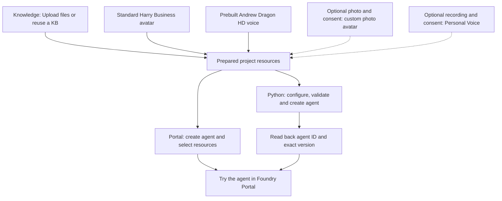

# Create a Foundry agent with Knowledge IQ, Andrew Dragon HD, and Harry Business

Prepare Knowledge and use the prebuilt **Andrew Dragon HD** voice with the **Standard Harry / Business** avatar, then create the agent in **Foundry Portal** or with Python. The Python template includes both selections at creation time. Custom photo avatars and Personal Voice are optional alternatives, with preparation and configuration steps below. Both paths finish with a voice conversation in the portal. No local browser proxy, microphone library, or hosted container is needed.

> **Results:** the Knowledge evaluation achieved **219 PASS / 18 FAIL (92.41%)** on 237 knowledge-covered questions. See [evaluation results](docs/evaluation.md) for the scoring scope, Foundry Portal workflow and Python creator checks.

## Choose your path

| Path | Use it for | Local setup |
| --- | --- | --- |
| [Foundry Portal — recommended](#create-in-foundry-portal) | Create and configure the agent through the UI | None; select existing Knowledge, voice and avatar |
| [Python — optional](#create-with-python) | Create from a JSON configuration and read back service-issued IDs and an exact version | Bundled SDK and existing resource connection values |

Start with [shared resource preparation](#prepare-your-project-and-assets), then choose **one** creation path. Existing resources can be reused. Portal users can skip the entire Python section, including SDK installation and MCP connection values.



| Stage | Output to retain locally | Check before continuing |
| --- | --- | --- |
| Shared preparation | Project, KB name, Andrew Dragon HD and Harry Business selections; runtime names if using custom assets | Access, voice/avatar availability and Knowledge processing; consent and successful processing for optional personal assets |
| Portal creation | Agent name and selected Knowledge, voice and avatar | Reopen the agent and check the selections |
| Python creation | Agent ID, name, version ID, exact version and read-back report | Stored definition matches the requested configuration |
| Portal interaction | Evaluation summary | Knowledge, selected voice and avatar work together |

## Prepare your project and assets

Use a Foundry project, not a hub-based project. Follow [subscription setup](../../setup_subscription.md) if a project is not already available. Confirm that the resource and region support the chosen voice and avatar capabilities. Native voice agents are preview.

The default Andrew + Standard Harry Business combination needs no personal photo, prompt audio, consent-media upload or asset-training task. Obtain approval for the destination, cost and permissions before uploading Knowledge documents. For optional custom photo avatars and Personal Voice, use your own likeness and voice or those of a person whose explicit authorization and required consent you hold. Keep credentials, consent media, real resource/asset identifiers and local output out of Git.

### Access

| Identity | Access needed |
| --- | --- |
| Agent creator | Foundry User on the appropriate Foundry scope to create/read agents |
| Knowledge administrator | Permission to create/manage Knowledge and upload authorized files; any resource access requested by the portal |
| Connection administrator, when needed | Foundry Project Manager or equivalent connection-write access |
| Foundry project's managed identity | Search Index Data Reader on the Search service for IQ runtime retrieval |

Reuse existing resources without uploading their files again. Complete any resource, model or permission prompts in the portal and allow time for role assignments to propagate. A separate Storage upload or manually defined Search index is not part of this walkthrough.

### Prepare Knowledge in the portal

[Foundry IQ](https://learn.microsoft.com/en-us/azure/foundry/agents/concepts/what-is-foundry-iq) provides reusable knowledge bases. Uploading files prepares the same Knowledge resource for either creation path; using Python does not require a second upload or manual document splitting.

1. Open [Foundry Portal](https://ai.azure.com/), select the project and use the **New Foundry** experience.
2. Open **Knowledge** and start creating a knowledge base. If a suitable Foundry IQ KB already exists, reuse it and skip its creation steps.
3. Under **Basic configuration**, enter a **Name** and an optional **Description**. For a minimal extractive setup, select **Retrieval reasoning effort: Minimal** and **Output mode: Extractive data**. Follow any **Chat completions model** requirements shown for the selected settings; add **Retrieval instructions** if needed.
4. Under **Knowledge sources (Foundry IQ)**, select **Upload files** and choose the authorized local documents. This is the upload action on the IQ knowledge-base page, next to **Add sources**.
5. Review the selected files and complete KB creation. Complete any resource or permission prompts, then wait for file processing to finish and resolve reported errors. The portal manages ingestion, including parsing, chunking and indexing.
6. Test a question supported by the documents in the Knowledge playground and inspect the returned references. Also test a question outside the corpus. Retain the KB name for agent configuration.

For a public starting corpus, use the complete [voice-agent overview](../sample_foundry_iq_doc/voice-agent-overview.md). For your own content, check usage rights, remove duplicated or unreadable material, preserve useful source references and avoid uploading evaluation answers as knowledge. Keep the document set unchanged during a test run.

### Select the prebuilt voice

The default voice is **Andrew Dragon HD** (`en-US-Andrew:DragonHDLatestNeural`). Select it directly rather than creating a Personal Voice. No prompt audio, voice-training task or voice-consent recording is needed. Check its availability for the intended resource and region in the [voice list](https://learn.microsoft.com/en-us/azure/ai-services/speech-service/language-support?tabs=tts).

### Select the standard avatar

Use **Standard → Harry / Business** from the avatar selector. This is a platform-provided full-body avatar; no photo upload or custom-avatar creation is needed. See the [standard avatar list](https://learn.microsoft.com/en-us/azure/ai-services/speech-service/text-to-speech-avatar/standard-avatars) for available characters. The Python template selects `character="harry"`, `style="business"` and `customized=false` using the native `video_avatar` type.

Continue to [Portal creation](#create-in-foundry-portal) or [Python creation](#create-with-python). Skip the next two sections unless you want a custom photo avatar or Personal Voice.

### Create your photo avatar

**Optional:** use this path instead of Standard Harry Business when you want a custom photo avatar. If a suitable avatar already exists in the intended resource, reuse it and retain its name. Confirm access and the required consent; there is no need to upload the photo or create the avatar again. An existing photo alone is not a created avatar resource. Andrew can still be used as the voice.

If you need a new avatar, in **Services**, open the **Customize** tab and select **Create** to open **Customize a model**. Use the [custom photo-avatar guide](https://learn.microsoft.com/en-us/azure/ai-services/speech-service/text-to-speech-avatar/custom-photo-avatar-create) for access, regional support and media requirements; follow the current navigation below.

1. **Basic details:** choose **Azure Speech - Text to Speech Avatar**, set **Type** to **Photo avatar**, and enter an **Avatar name** and an optional **Description**.
2. **Data:** set **Select data source** to **Create with image**. Select **Upload data** to upload the authorized photo, or choose an existing image under **Select data**. Check the **Data preview** and continue.
3. **Register avatar talent:** select an existing consent video for the person in the photo, or select **Add avatar talent**. Choose **Speaking language**, fill in **Avatar talent name** and **Company name**, and have that person record the exact verbal consent statement displayed by the portal. On **Local files**, upload the video, then select it under **Select avatar talent**. The photo and consent video must represent the same consenting person.
4. **Review:** check the model, type, avatar name, photo and selected consent video. Read the pricing information, acknowledge that training incurs usage charges, and select **Submit**.

The consent dialog accepts `.mp4` or `.mov`, smaller than 500 MB, longer than 3 seconds and shorter than 1 minute; follow the limits displayed in the portal. Wait for creation to reach **Succeeded** and retain the custom photo-avatar name, not the image filename or consent name. Use **Try Voice Live / Open in Playground** to preview the created avatar and check its likeness and resource association.

A prebuilt voice does not replace the consent required for a real-person photo avatar. Use the person's required consent video, not a synthesized consent statement.

### Create your Personal Voice

**Optional:** use this path instead of Andrew Dragon HD when you need a consent-based Personal Voice. It is the only custom-voice workflow in this sample.

In **Services**, open the **Customize** tab and select **Create** to open **Customize a model**:

1. **Basic details:** choose **Azure Speech - Text to Speech**, set **Type** to **Personal voice**, and enter a **Voice name** and an optional **Description**.
2. **Register voice talent:** select an existing consent for the speaker, or use **Add voice talent → Upload data / Record data**. Set the language, voice talent name and company name, then upload or record the speaker reading the exact consent statement displayed by the portal. Wait for **Succeeded** and select that voice talent. See the [consent requirements](https://learn.microsoft.com/en-us/azure/ai-services/speech-service/personal-voice-create-consent).
3. **Training data:** use **New data** to upload or record a clean, single-speaker **5–90-second** sample from the same consenting person. Check the selected audio in **Data preview**. This is the voice sample used for synthesis, separate from the consent recording. Follow the [audio requirements](https://learn.microsoft.com/en-us/azure/ai-services/speech-service/personal-voice-create-voice).
4. **Review:** check the voice settings, selected talent and training audio. Complete the displayed acknowledgments, review any charges and submit. Wait for the voice creation task to complete successfully.

Open the completed customization, preview synthesis and retain the created voice name. Continue with either [Portal creation](#create-in-foundry-portal) or [Python creation](#create-with-python); both reuse these resources.

## Create in Foundry Portal

This is the recommended path for a complete UI walkthrough. It needs no Python environment, JSON template or manually collected MCP connection values.

1. In the same project, open **Agents** and use the agent creation action. Give the agent a name and open its **Playground**.
2. Select a model available for voice interaction, enable **Voice mode**, and set **Instructions** to use the Knowledge source for factual questions, include source references and acknowledge when the source does not contain an answer.
3. Expand **Knowledge**, select **Add**, and choose the KB prepared above from **Available knowledge bases**. If the KB needs connecting to this project, use **Connect to Foundry IQ** and complete that flow. Confirm that the selected KB appears in the Knowledge section. The **Tools → Upload files** action is a separate entry point; use **Knowledge → Add** here.
4. Open the gear icon for **Configuration**. Under **Speech output → Voice**, search the prebuilt voices for **Andrew**, select the **Dragon HD** version and preview it. For the optional Personal Voice path, choose **Custom → Personal** and select your created voice instead.
5. Enable **Avatar** and open **More avatars → Standard**. Choose **Harry / Business** and select **Save**. For the optional custom photo path, choose **Custom → Photo avatar** and select your prepared avatar instead.
6. Complete any save/apply actions offered by the agent configuration UI. Reopen the same agent and check its Knowledge, voice and avatar selections. Review the project's applicable conversation storage, access and retention settings before starting a conversation.

Continue directly to [Try the agent in Foundry Portal](#try-the-agent-in-foundry-portal). There is no need to create a second agent with Python.

## Create with Python

Use this path when you want a local configuration and explicit native agent IDs/version read-back. Reuse the resources prepared above. The creator only validates, creates and reads agent definitions; it does not provision Knowledge, assign roles, upload personal media or create Speech assets.

### Install the creator

Use an isolated environment; the recorded run uses Python 3.13 in WSL Ubuntu. In WSL, open this repository through its `/mnt/c/...` path. From `VoiceAgent`, choose an unused environment path:

```bash
VENV="$HOME/.venvs/create-agent-with-iq-avatar-voice"
if [ -e "$VENV" ] || [ -L "$VENV" ]; then
  printf '%s\n' 'Choose a new environment path; do not overwrite an existing environment.'
else
  python3.13 -m venv "$VENV" &&
  env -u PIP_EXTRA_INDEX_URL -u PIP_INDEX_URL PIP_CONFIG_FILE=/dev/null \
    "$VENV/bin/python" -m pip install --index-url https://pypi.org/simple \
    -r samples/create-agent-with-iq-avatar-voice/requirements.txt
fi
```

After successful installation:

```bash
source "$VENV/bin/activate"
python -m pip check
cd samples/create-agent-with-iq-avatar-voice
python -c 'import create_agent; create_agent.require_sdk()'
python create_agent.py --help
```

For an existing verified installation of 2.7.0 or later, activate its environment and skip creation/install. Upgrade older installations with this sample's requirements first. Run the remaining commands from `VoiceAgent/samples/create-agent-with-iq-avatar-voice`. The requirements use `azure-ai-projects>=2.7.0` from PyPI. No `[voice]` extra, PyAudio or Voice Live SDK is needed. Transitive dependencies resolve from the package metadata.

Sign in through Azure CLI or another supported `DefaultAzureCredential` identity before cloud commands. `validate` needs neither credentials nor network access. The CLI does not load or rewrite `.env` files.

### Reuse the Knowledge connection

The Python creator references **Foundry IQ's Search KB MCP endpoint** using two values from the existing integration. A **RemoteTool connection** is a project configuration that stores the tool endpoint and authentication settings; it is not another knowledge base. The agent references its name to use that existing connection without embedding credentials in the JSON.

| Creator field | Value and source |
| --- | --- |
| `definition.tools[0].server_url` | Copy the corresponding RemoteTool connection's full `target` URL, including its existing `api-version` |
| `definition.tools[0].project_connection_id` | That **project RemoteTool connection's name**, not its ARM ID, a KB name or an ordinary Azure AI Search connection name |

Read the existing configuration through the available portal details or use the read-only lookup below. Copy the **project endpoint** from your Foundry project's overview, and the KB name from **Knowledge**. Replace both placeholders and run in the activated environment. This lists existing project connections without requesting credential values; it does not create or update resources.

```bash
python - <<'PY'
from urllib.parse import urlsplit

from azure.ai.projects import AIProjectClient
from azure.identity import DefaultAzureCredential

endpoint = "<project-endpoint>"
knowledge_base = "<knowledge-base-name>"

with DefaultAzureCredential() as credential, AIProjectClient(
    endpoint=endpoint, credential=credential, allow_preview=True
) as client:
    for connection in client.connections.list():
        if connection.type not in ("RemoteTool", "RemoteTool_Preview"):
            continue
        target = urlsplit(connection.target)
        if (
            target.scheme == "https"
            and (target.hostname or "").endswith(".search.windows.net")
            and target.path == f"/knowledgebases/{knowledge_base}/mcp"
        ):
            print(f"name: {connection.name}\ntarget: {connection.target}\n")
PY
```

Copy the printed `name` into `project_connection_id` and its `target` into `server_url`. If several connections match, choose the one for the intended Search service and KB; do not simply take the first. If none match, check the selected project and KB name. Do not request credentials or print the entire connection object.

If the project MCP connection does not exist, complete the official [Connect agents to Foundry IQ](https://learn.microsoft.com/en-us/azure/foundry/agents/how-to/foundry-iq-connect#create-a-project-connection) setup once. Use the project's managed identity with Search read access, confirm the connection target and audience, and reuse it here. The creator does not provision or replace the connection.

Use the full target and name from the **same connection**. The templates show this URL shape:

```text
https://<search-service>.search.windows.net/knowledgebases/<knowledge-base>/mcp?api-version=<search-api-version>
```

The sample does not pin one Search API version. Copying the full target replaces all URL placeholders, including `<search-api-version>`; there is no separate version to choose. For example, if the existing target uses `2026-05-01-preview`, retain that value rather than changing it to `2026-08-01-preview`.

[Azure AI Search requires `api-version` in request URIs](https://learn.microsoft.com/en-us/rest/api/searchservice/#calling-the-apis), so do not remove it. Local validation accepts exactly one version parameter in `YYYY-MM-DD`, `YYYY-MM-DD-preview` or `YYYY-MM-DD-Preview` format, with no other query parameters. This checks syntax, not whether a particular version is supported by your service. The creator preserves the URL exactly; it does not discover, upgrade or negotiate versions. Do not append tokens/SAS parameters. The official [connection guide](https://learn.microsoft.com/en-us/azure/foundry/agents/how-to/foundry-iq-connect#required-values) explains the endpoint and connection values. The Search version in this URL is separate from the Projects SDK API version and the agent version returned by `create`.

The [IQ upload workflow](#prepare-knowledge-in-the-portal) prepares the KB used here. Separate `file_search` or Toolbox identifiers are not substitutes for its MCP URL and RemoteTool connection name. This sample uses `knowledge_base_retrieve` through that KB connection without duplicating ingestion.

### Configure the native definition

Start with [agent.example.json](agent.example.json), which selects **Andrew Dragon HD + Standard Harry Business**, and copy it to an ignored local file using a new filename if that file already exists:

```bash
cp -n agent.example.json agent.local.json
```

The default template already contains the following fields inside `definition`. Keep them for the default combination; Python saves the voice and avatar together when creating the agent, without a later Portal avatar-selection step.

```json
{
  "avatar": {
    "type": "video_avatar",
    "character": "harry",
    "style": "business",
    "customized": false,
    "output_protocol": "webrtc"
  },
  "output_modalities": ["text", "audio", "avatar"]
}
```

**Optional custom photo avatar:** complete [photo-avatar preparation](#create-your-photo-avatar), then **replace the entire `definition.avatar` object** with the one below. Do not shallow-merge it with Harry's settings: remove the standard-only `style` field. Retain the shown `output_modalities`; do not replace the whole definition or add duplicate keys.

```json
{
  "avatar": {
    "type": "photo_avatar",
    "character": "<custom-photo-avatar-name>",
    "customized": true,
    "model": "vasa-1",
    "output_protocol": "webrtc"
  },
  "output_modalities": ["text", "audio", "avatar"]
}
```

Use the existing custom photo-avatar name, not a photo filename or URL. For the no-avatar baseline, **delete the entire `definition.avatar` object** and set `output_modalities` to `["text", "audio"]`. For either avatar type, select the protocol supported by the intended interaction surface.

Replace every placeholder. PowerShell users can use `Copy-Item`. Keep the local configuration private and do not add credentials.

- `project_endpoint`: copy the **project endpoint** from the Foundry project's overview: `https://<account>.services.ai.azure.com/api/projects/<project>`. Do not use the Azure OpenAI endpoint or the project's ARM resource ID. Neither the ARM ID nor the tenant ID is a field in this sample's JSON.
- `agent_name`: choose an unused name for the new agent; this is also the name to find in Portal. Existing agents are not overwritten.
- `model_type="managed"`: a service-managed model such as `gpt-realtime`.
- `model_type="self_deployed"`: `model` names a deployment in your project.

**Optional Personal Voice:** complete [Personal Voice preparation](#create-your-personal-voice), then copy [agent.personal.example.json](agent.personal.example.json) to a new `agent.personal.local.json` instead. That template already includes a custom photo avatar. To use Personal Voice with Harry Business, replace its entire `avatar` object with the standard object shown above, removing `model="vasa-1"`; keep all three output modalities.

In supported Voice Live tooling for the intended runtime resource, select the created voice and retain its **Personal Voice runtime name** for `audio.output.voice`, with `voice_type="azure-personal"`. Keep consent IDs, management `personalVoiceId` and `speakerProfileId` separate from this runtime name. Resolve the selection through supported tooling rather than guessing or automatically converting IDs. Set `personal_voice_model` to the synthesis base model, `DragonLatestNeural` or `DragonHDOmniLatestNeural`, never a profile ID. The [Voice Live customization guide](https://learn.microsoft.com/en-us/azure/ai-services/speech-service/voice-live-how-to-customize) describes its name/model fields. To switch back to Andrew, set `voice_type="azure-standard"`, `voice="en-US-Andrew:DragonHDLatestNeural"` and delete `personal_voice_model` entirely.

| Field | Meaning |
| --- | --- |
| `project_endpoint` | Foundry project data-plane endpoint |
| `agent_name` | A fresh name; existing agents are not overwritten or versioned implicitly |
| `definition.kind` | `voice`, not `prompt` or `hosted` |
| `model_type` / `model` | Managed model or self-deployed project deployment |
| MCP `server_url` / `project_connection_id` | The KB MCP URL and project connection name from [connection setup](#reuse-the-knowledge-connection) |
| `allowed_tools` | Only `knowledge_base_retrieve` |
| `audio.output.voice_type` | `azure-standard` for Andrew; `azure-personal` for the optional Personal Voice path |
| `audio.output.voice` | `en-US-Andrew:DragonHDLatestNeural`, or the Personal Voice runtime name |
| `audio.output.personal_voice_model` | Omit for standard voices; Personal Voice only: synthesis base model (Voice Live `voice.model`) |
| `avatar.type` | Native `video_avatar` for standard avatars or `photo_avatar` for custom photos; underscores, not hyphenated wire spellings |
| `avatar.character` | Standard: `harry`; custom photo: created avatar runtime name, not a filename or URL |
| `avatar.style` | Standard only: explicit style, `business` for the default Harry avatar; omit for custom photo |
| `avatar.customized` | Explicit boolean: `false` for standard, `true` for custom photo |
| `avatar.model` | Custom photo only: `vasa-1`; omit for standard |
| `avatar.output_protocol` | Explicit `webrtc` or `websocket`; the template selects `webrtc` |
| `store` | Explicitly `false` in the Python templates; enable storage only after deciding retention and access |

Use the native field names from the [Projects SDK 2.7.0](https://pypi.org/project/azure-ai-projects/2.7.0/), not a public Voice Live `session.update` object. Keep instructions requiring retrieval for factual questions, source references and an honest unknown answer when the corpus does not support a claim.

The creator also supports isolated checks, retaining Knowledge in every configuration:

| Configuration | Template and changes | `output_modalities` |
| --- | --- | --- |
| Andrew + Standard Harry Business (default) | Use `agent.example.json`; replace placeholders only | `["text", "audio", "avatar"]` |
| Andrew + custom photo | Replace the default template's entire `avatar` object with the custom photo object above | `["text", "audio", "avatar"]` |
| Andrew, no avatar | Delete the default template's `avatar` object and update modalities | `["text", "audio"]` |
| Personal Voice + Standard Harry Business | Use `agent.personal.example.json`; replace its entire `avatar` object with the standard object above | `["text", "audio", "avatar"]` |
| Personal Voice + custom photo | Use `agent.personal.example.json`; replace placeholders only | `["text", "audio", "avatar"]` |
| Personal Voice, no avatar | Delete the personal template's `avatar` object and update modalities | `["text", "audio"]` |

The commands below use `agent.local.json`. For the optional Personal Voice path, substitute `agent.personal.local.json` in each command. Changing a local file does not update an existing Portal agent.

Validate the completed configuration before creating:

```bash
python create_agent.py validate --config agent.local.json
```

Unchanged templates intentionally fail validation. Local validation checks fields; consent, resource access and asset availability are handled during shared preparation. Unknown fields and unsupported settings are rejected. There is no asset-ID conversion, bypass or silent fallback to standard assets.

### Create and read back identifiers

Review the selected configuration and obtain approval before creating the named agent. Run only the scenario you intend to use:

```bash
mkdir -p local-output
python create_agent.py create --config agent.local.json --output local-output/agent.json
```

The creator:

1. Validates locally and checks that the agent name does not exist. Do not run concurrent creators for the same name; this preflight is not an atomic name reservation.
2. Calls `AIProjectClient(..., allow_preview=True).agents.create_version(...)` once, without automatic retries.
3. Reads the returned **exact version** and agent details, comparing requested model, Knowledge, voice, avatar and output settings with the saved definition.
4. Prints the service-issued `agent_id`, `agent_name`, `version_id`, `version`, optional `agent_guid`, `state` and `agent_endpoint`. Agent ID and version ID are distinct; missing values are not invented. Definition hashes are diagnostics, not a requirement that service-added defaults be absent.

The same report is saved to the `--output` JSON file (`local-output/agent.json` above). Successful creation reports `creation_status="created"` and `definition_verified=true`. Retain the returned IDs for lookup and diagnostics; they do not need to be copied into the input configuration.

Inspect the same version without creating another. Use the report's **`version`**, not `version_id` or `agent_guid`: for example, if `version` is `"1"`, pass `--version "1"`.

```bash
python create_agent.py show --config agent.local.json --version "<returned-version>"
```

For the optional Personal Voice path, use `agent.personal.local.json` and a different output filename, such as `local-output/personal-agent.json`. Keep the configuration used for the exact version: `show` compares against it and rejects `latest`. Existing output files are never overwritten.

On partial failure, inspect the reported name/version before retrying: creation may have succeeded even if verification failed. The CLI does not delete agents or enable disabled agents. Read-back verifies stored settings; the next section covers interaction.

Open the **same project** as `project_endpoint` in Foundry Portal and locate the returned `agent_name`. If creation and read-back succeeded but the agent is missing from the list, see [Python-created agent missing from Portal](#python-created-agent-missing-from-portal). Compare the agent ID and exact version with the creator's report wherever displayed; retain the report for fields the UI does not expose. Continue to [Try the agent in Foundry Portal](#try-the-agent-in-foundry-portal) using that agent rather than creating another.

### Run Python offline checks

From the sample directory with its environment activated:

```bash
python -m unittest -v test_create_agent.py
python create_agent.py --help
```

Tests use the actual released SDK with fake credentials and in-memory HTTP responses; no Azure request or microphone access is needed.

## Try the agent in Foundry Portal

Use the agent from your chosen creation path:

1. Open the agent's **Playground** in the same project and check the model, **Knowledge**, **Voice mode**, selected voice and avatar. For the default configuration, confirm **Andrew Dragon HD + Standard Harry / Business**. If the agent is disabled, review its state and explicitly enable it through supported management tooling.
2. Open the voice interaction surface, choose a microphone, grant browser permission and select **Start**.
3. Ask a question supported by the uploaded documents and inspect the answer and source references. Ask an unsupported question and check that the agent acknowledges the gap instead of inventing an answer.
4. Check the selected voice, audible playback and interruption. If an avatar is configured, also check its expected likeness and audio/video synchronization. Summarize observed issues separately from successful checks.

## Results and cleanup

[Evaluation results](docs/evaluation.md) records the benchmark on 237 knowledge-covered questions, final failure breakdown, Portal functional result and Python test results. Per-question answers or recordings are not required in the public sample. The Python templates set `store=false`; for Portal-created agents, review the applicable storage, access and retention settings. Do not enable recording merely to fill an evaluation summary.

For cleanup, review the agent/version created for this sample. Remove only explicitly approved resources through supported interfaces. **Do not delete a reused KB, connection, storage container or personal asset** just because the sample is finished. Removing an agent does not remove its dependencies. Follow the applicable retention policy for consent and biometric data.

## Troubleshooting

| Symptom | Check |
| --- | --- |
| KB missing from the agent | Same project, **Knowledge → Add**, or **Connect to Foundry IQ** |
| Andrew Dragon HD missing from the voice selector | Prebuilt voice list, HD variant and support for the selected resource/region; do not look under **Custom → Personal** |
| Harry Business missing from the avatar selector | **More avatars → Standard**, the Business style and avatar support for the selected resource/region |
| Optional Personal Voice/photo avatar missing from selectors | Same resource/project, asset processing status, access, **Custom → Personal** for voice or **Custom → Photo avatar** for avatar |
| Knowledge returns nothing | Uploaded-file processing status, selected source/corpus and the KB retrieval test |
| Knowledge 401/403 | Project identity, Search reader role and connection scope/target/audience |
| Personal Voice/photo avatar fails | Consent, selected asset, resource/region access and standalone preview |
| Python placeholder/unknown field rejected | Complete the native template; do not paste a different agent or Voice Live wire configuration |
| Python Knowledge configuration rejected | Copy the full RemoteTool target, retaining exactly one `api-version`, and use that connection's name; no File Search or Toolbox identifiers |
| Python agent already exists | Inspect its exact version or choose a genuinely new name |
| Python-created agent missing from Portal after successful read-back | Same project, returned name and [Portal preview visibility](#python-created-agent-missing-from-portal) |
| Python create/read-back 401/403 | Identity, project access and preview availability |
| Model not found | Availability in the selected project/region; for Python, managed versus self-deployed selection |
| Voice interaction unavailable | Selected agent, Voice mode, model/resource support and browser microphone permission |

### Python-created agent missing from Portal

If `create` and exact-version `show` both report `definition_verified=true`, first confirm the browser identity, project and returned `agent_name`, and use **New Foundry**. If the agent still does not appear, the current preview Portal experience may need the `flight=voice_agent_bundle` URL parameter:

- If the URL already has a query (`?`), append `&flight=voice_agent_bundle`; otherwise append `?flight=voice_agent_bundle`.
- Preserve the rest of the URL. Add the parameter before any `#` fragment; if a `flight` parameter already exists, edit it rather than adding a duplicate.
- Reload the page, clear the Agents search and search for the returned name again.

This parameter resolved visibility in the [recorded Portal check](docs/evaluation.md#andrew-and-harry-cloud-and-portal-checks). The repository's [Voice Agent trace URL helper](../foundry_trace_url.py) also uses it. Treat it as a preview troubleshooting step, not a permanent requirement for every project. It is a Portal URL setting, separate from the SDK's `allow_preview=True`; it does not grant resource permissions or create/publish an agent. Do not recreate or publish an agent merely because the list is empty. If it remains missing, inspect the Portal list request's status and filters without sharing authorization headers or cookies.

## Sources

- [Projects SDK 2.7.0 source](https://github.com/Azure/azure-sdk-for-python/tree/azure-ai-projects_2.7.0/sdk/ai/azure-ai-projects)
- [Foundry IQ overview and portal workflow](https://learn.microsoft.com/en-us/azure/foundry/agents/concepts/what-is-foundry-iq)
- [Foundry IQ project connection](https://learn.microsoft.com/en-us/azure/foundry/agents/how-to/foundry-iq-connect)
- [Standard avatar list](https://learn.microsoft.com/en-us/azure/ai-services/speech-service/text-to-speech-avatar/standard-avatars)
- [Harry Business preset values in this repository](https://github.com/Azure-Samples/Cognitive-Speech-TTS/blob/6d5c9d8c71e5c1234bbce541c0378fb6e3a8277a/VoiceAgent/portal/web/src/lib/avatar.mjs#L7)
- [Photo-avatar creation](https://learn.microsoft.com/en-us/azure/ai-services/speech-service/text-to-speech-avatar/custom-photo-avatar-create)
- [Personal Voice creation and preview](https://learn.microsoft.com/en-us/azure/ai-services/speech-service/personal-voice-create-voice)
- [Voice Live personal-voice configuration](https://learn.microsoft.com/en-us/azure/ai-services/speech-service/voice-live-how-to-customize)
