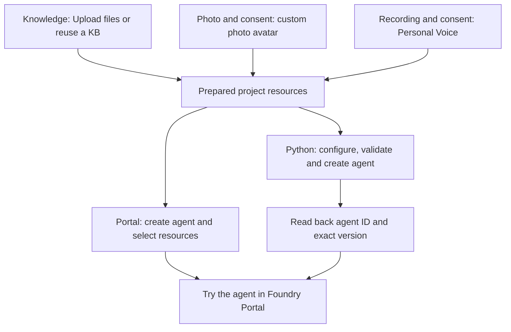

# Create a Foundry agent with Knowledge IQ, custom photo avatar, and Personal Voice

Prepare Knowledge and consent-based personal assets once in **Foundry Portal**, then create the agent in the portal or with Python. Both paths finish with a voice conversation in the portal. No local UI, microphone library, hosted container or browser proxy is needed.

> **Results:** see [evaluation results](docs/evaluation.md) for the 252-question Knowledge benchmark, the Foundry Portal workflow and Python creator checks.

## Choose your path

| Path | Use it for | Local setup |
| --- | --- | --- |
| [Foundry Portal — recommended](#create-in-foundry-portal) | Create and configure the agent through the UI | None; select existing Knowledge, voice and avatar |
| [Python — optional](#create-with-python) | Create from a JSON configuration and read back service-issued IDs and an exact version | Bundled SDK and existing resource connection values |

Start with [shared resource preparation](#prepare-your-project-and-assets), then choose **one** creation path. Existing resources can be reused. Portal users can skip the entire Python section, including SDK installation and MCP connection values.



| Stage | Output to retain locally | Check before continuing |
| --- | --- | --- |
| Shared preparation | Project, KB name, custom photo-avatar name and Personal Voice name | Access, consent, successful file/asset processing and previews |
| Portal creation | Agent name and selected Knowledge, voice and avatar | Reopen the agent and check the selections |
| Python creation | Agent ID, name, version ID, exact version and read-back report | Stored definition matches the requested configuration |
| Portal interaction | Evaluation summary | Knowledge, selected voice and avatar work together |

## Prepare your project and assets

Use a Foundry project, not a hub-based project. Follow [subscription setup](../../setup_subscription.md) if a project is not already available. Confirm that the resource and region support the chosen voice and photo-avatar capabilities. Native voice agents are preview.

Obtain approval for the destination, cost and permissions before uploading documents or personal media. Use your own voice and likeness or those of a person whose explicit authorization and required consent you hold. Keep credentials, consent media, real resource/asset identifiers and local output out of Git.

### Access

| Identity | Access needed |
| --- | --- |
| Agent creator | Foundry User on the appropriate Foundry scope to create/read agents |
| Knowledge administrator | Permission to create/manage Knowledge and upload authorized files; any resource access requested by the portal |
| Connection administrator, when needed | Foundry Project Manager or equivalent connection-write access |
| Foundry project's managed identity | Search Index Data Reader on the Search service for IQ runtime retrieval |

Reuse existing resources without uploading their files again. Complete any resource, model or permission prompts in the portal and allow time for role assignments to propagate. A separate Storage upload or manually defined Search index is not part of this walkthrough.

### Prepare Knowledge in the portal

[Foundry IQ](https://learn.microsoft.com/en-us/azure/foundry/agents/concepts/what-is-foundry-iq) provides reusable knowledge bases. Uploading files prepares the same Knowledge resource for either creation path; using Python does not require a second upload or manual document splitting.

1. Open [Foundry Portal](https://ai.azure.com/), select the project and use the **New Foundry** experience.
2. Open **Knowledge** and start creating a knowledge base. If a suitable Foundry IQ KB already exists, reuse it and skip its creation steps.
3. Under **Basic configuration**, enter a **Name** and an optional **Description**. For a minimal extractive setup, select **Retrieval reasoning effort: Minimal** and **Output mode: Extractive data**. Follow any **Chat completions model** requirements shown for the selected settings; add **Retrieval instructions** if needed.
4. Under **Knowledge sources (Foundry IQ)**, select **Upload files** and choose the authorized local documents. This is the upload action on the IQ knowledge-base page, next to **Add sources**.
5. Review the selected files and complete KB creation. Complete any resource or permission prompts, then wait for file processing to finish and resolve reported errors. The portal manages ingestion, including parsing, chunking and indexing.
6. Test a question supported by the documents in the Knowledge playground and inspect the returned references. Also test a question outside the corpus. Retain the KB name for agent configuration.

For a public starting corpus, use the complete [voice-agent overview](../sample_foundry_iq_doc/voice-agent-overview.md). For your own content, check usage rights, remove duplicated or unreadable material, preserve useful source references and avoid uploading evaluation answers as knowledge. Keep the document set unchanged during a test run.

### Create your photo avatar

In **Services**, open the **Customize** tab and select **Create** to open **Customize a model**. Use the [custom photo-avatar guide](https://learn.microsoft.com/en-us/azure/ai-services/speech-service/text-to-speech-avatar/custom-photo-avatar-create) for access, regional support and media requirements; follow the current navigation below.

1. **Basic details:** choose **Azure Speech - Text to Speech Avatar**, set **Type** to **Photo avatar**, and enter an **Avatar name** and an optional **Description**.
2. **Data:** set **Select data source** to **Create with image**. Select **Upload data** to upload the authorized photo, or choose an existing image under **Select data**. Check the **Data preview** and continue.
3. **Register avatar talent:** select an existing consent video for the person in the photo, or select **Add avatar talent**. Choose **Speaking language**, fill in **Avatar talent name** and **Company name**, and have that person record the exact verbal consent statement displayed by the portal. On **Local files**, upload the video, then select it under **Select avatar talent**. The photo and consent video must represent the same consenting person.
4. **Review:** check the model, type, avatar name, photo and selected consent video. Read the pricing information, acknowledge that training incurs usage charges, and select **Submit**.

The consent dialog accepts `.mp4` or `.mov`, smaller than 500 MB, longer than 3 seconds and shorter than 1 minute; follow the limits displayed in the portal. Wait for creation to reach **Succeeded** and retain the custom photo-avatar name, not the image filename or consent name. Use **Try Voice Live / Open in Playground** to preview the created avatar and check its likeness and resource association.

### Create your Personal Voice

Personal Voice is the only custom-voice workflow in this sample. Prebuilt standard voices remain available as a baseline.

In **Services**, open the **Customize** tab and select **Create** to open **Customize a model**:

1. **Basic details:** choose **Azure Speech - Text to Speech**, set **Type** to **Personal voice**, and enter a **Voice name** and an optional **Description**.
2. **Register voice talent:** select an existing consent for the speaker, or use **Add voice talent → Upload data / Record data**. Set the language, voice talent name and company name, then upload or record the speaker reading the exact consent statement displayed by the portal. Wait for **Succeeded** and select that voice talent. See the [consent requirements](https://learn.microsoft.com/en-us/azure/ai-services/speech-service/personal-voice-create-consent).
3. **Training data:** use **New data** to upload or record a clean, single-speaker **5–90-second** sample from the same consenting person. Check the selected audio in **Data preview**. This is the voice sample used for synthesis, separate from the consent recording. Follow the [audio requirements](https://learn.microsoft.com/en-us/azure/ai-services/speech-service/personal-voice-create-voice).
4. **Review:** check the voice settings, selected talent and training audio. Complete the displayed acknowledgments, review any charges and submit. Wait for the voice creation task to complete successfully.

Open the completed customization, preview synthesis and retain the created voice name. Continue with either [Portal creation](#create-in-foundry-portal) or [Python creation](#create-with-python); both reuse these resources.

## Create in Foundry Portal

This is the recommended path for a complete UI walkthrough. It needs no Python environment, JSON template or manually collected MCP connection values.

1. In the same project, open **Agents** and use the agent creation action. Give the agent a name and open its **Playground**.
2. Select a model available for voice interaction, enable **Voice mode**, and set **Instructions** to use the Knowledge source for factual questions, include source references and acknowledge when the source does not contain an answer.
3. Expand **Knowledge**, select **Add**, and choose the KB prepared above from **Available knowledge bases**. If the KB needs connecting to this project, use **Connect to Foundry IQ** and complete that flow. Confirm that the selected KB appears in the Knowledge section. The **Tools → Upload files** action is a separate entry point; use **Knowledge → Add** here.
4. Open the gear icon for **Configuration**. Under **Speech output → Voice**, open the voice selector, choose **Custom → Personal**, and select the created Personal Voice.
5. Enable **Avatar**. Select the custom photo avatar if already displayed, or open **More avatars → Custom → Photo avatar**, choose the created avatar and select **Save**.
6. Complete any save/apply actions offered by the agent configuration UI. Reopen the same agent and check its Knowledge, voice and avatar selections. Review the project's applicable conversation storage, access and retention settings before starting a conversation.

Continue directly to [Try the agent in Foundry Portal](#try-the-agent-in-foundry-portal). There is no need to create a second agent with Python.

## Create with Python

Use this path when you want a local configuration and explicit native agent IDs/version read-back. Reuse the resources prepared above. The creator only validates, creates and reads agent definitions; it does not provision Knowledge, assign roles, upload personal media or create Speech assets.

### Install the creator

Use an isolated environment; the recorded run uses Python 3.13 in WSL Ubuntu. In WSL, open this repository through its `/mnt/c/...` path. From `VoiceAgent`, choose an unused environment path:

```bash
VENV="$HOME/.venvs/create-agent-with-iq-avatar-voice"
if [ -e "$VENV" ] || [ -L "$VENV" ]; then
  printf '%s\n' 'Choose a new environment path; do not overwrite an existing environment.'
else
  python3.13 -m venv "$VENV" &&
  env -u PIP_EXTRA_INDEX_URL -u PIP_INDEX_URL PIP_CONFIG_FILE=/dev/null \
    "$VENV/bin/python" -m pip install --index-url https://pypi.org/simple \
    -r samples/create-agent-with-iq-avatar-voice/requirements.txt
fi
```

After successful installation:

```bash
source "$VENV/bin/activate"
python -m pip check
cd samples/create-agent-with-iq-avatar-voice
python -c 'import create_agent; create_agent.require_sdk()'
python create_agent.py --help
```

For an existing verified installation, activate its environment and skip creation/install. Run the remaining commands from `VoiceAgent/samples/create-agent-with-iq-avatar-voice`. The requirements use the **bundled** `azure-ai-projects` 2.7.0b1 build, not an arbitrary package with the same version. Its source and checksum are in [dist/README.md](../../dist/README.md). No `[realtime]` extra, PyAudio or Voice Live SDK is needed. Transitive dependencies resolve from the wheel's metadata.

Sign in through Azure CLI or another supported `DefaultAzureCredential` identity before cloud commands. `validate` needs neither credentials nor network access. The CLI does not load or rewrite `.env` files.

### Reuse the Knowledge connection

The Python creator references **Foundry IQ's Search KB MCP endpoint** using two values from the existing integration:

| Creator field | Value and source |
| --- | --- |
| `definition.tools[0].server_url` | The KB MCP endpoint from the existing KB integration configuration or the corresponding RemoteTool connection's `target` |
| `definition.tools[0].project_connection_id` | That **project RemoteTool connection's name**, not its ARM ID, a KB name or an ordinary Azure AI Search connection name |

Read the existing configuration through the available portal details or supported management API; do not copy credentials. If the project MCP connection does not exist, complete the official [Connect agents to Foundry IQ](https://learn.microsoft.com/en-us/azure/foundry/agents/how-to/foundry-iq-connect#create-a-project-connection) setup once. Use the project's managed identity with Search read access, confirm the connection target and audience, and reuse it here. The creator does not provision or replace the connection.

The current template accepts this endpoint shape and Search API version:

```text
https://<search-service>.search.windows.net/knowledgebases/<knowledge-base>/mcp?api-version=2026-08-01-preview
```

The official [connection guide](https://learn.microsoft.com/en-us/azure/foundry/agents/how-to/foundry-iq-connect#required-values) identifies the Search service endpoint and KB name used in this URL. Confirm compatibility with the existing integration; do not rewrite a different API version or append tokens/SAS parameters merely to pass local validation.

The [IQ upload workflow](#prepare-knowledge-in-the-portal) prepares the KB used here. Separate `file_search` or Toolbox identifiers are not substitutes for its MCP URL and RemoteTool connection name. This sample uses `knowledge_base_retrieve` through that KB connection without duplicating ingestion.

### Configure the native definition

For all three capabilities together, copy [agent.personal.example.json](agent.personal.example.json) to an ignored local file:

```bash
cp agent.personal.example.json agent.personal.local.json
```

Replace every placeholder. PowerShell users can use `Copy-Item`. Keep the local configuration private and do not add credentials.

- `project_endpoint`: `https://<account>.services.ai.azure.com/api/projects/<project>`, not the project's ARM resource ID.
- `model_type="managed"`: a service-managed model such as `gpt-realtime`.
- `model_type="self_deployed"`: `model` names a deployment in your project.

In supported Voice Live tooling for the intended runtime resource, select the created voice and retain its **Personal Voice runtime name** for `audio.output.voice`. Keep consent IDs, management `personalVoiceId` and `speakerProfileId` separate from this runtime name. Resolve the selection through supported tooling rather than guessing or automatically converting IDs. Set `personal_voice_model` to the synthesis base model, `DragonLatestNeural` or `DragonHDOmniLatestNeural`, never a profile ID. The [Voice Live customization guide](https://learn.microsoft.com/en-us/azure/ai-services/speech-service/voice-live-how-to-customize) describes its name/model fields; the native mapping is below.

| Field | Meaning |
| --- | --- |
| `project_endpoint` | Foundry project data-plane endpoint |
| `agent_name` | A fresh name; existing agents are not overwritten or versioned implicitly |
| `definition.kind` | `voice`, not `prompt` or `hosted` |
| `model_type` / `model` | Managed model or self-deployed project deployment |
| MCP `server_url` / `project_connection_id` | The KB MCP URL and project connection name from [connection setup](#reuse-the-knowledge-connection) |
| `allowed_tools` | Only `knowledge_base_retrieve` |
| `audio.output.voice_type` | `azure-personal` |
| `audio.output.voice` | Personal Voice runtime name (Voice Live `voice.name`) |
| `audio.output.personal_voice_model` | Synthesis base model (Voice Live `voice.model`) |
| `avatar.type` | Native `photo_avatar` with an underscore, not the public wire spelling `photo-avatar` |
| `avatar.character` | Created custom photo-avatar name, not an image filename or source-photo URL |
| `avatar.customized` / `avatar.model` | `true` / `vasa-1` |
| `avatar.output_protocol` | Explicit `webrtc` or `websocket`; the template selects `webrtc` |
| `store` | Explicitly `false` in the Python templates; enable storage only after deciding retention and access |

Use the native field names from the [bundled SDK](../../dist/README.md), not a public Voice Live `session.update` object. Keep instructions requiring retrieval for factual questions, source references and an honest unknown answer when the corpus does not support a claim.

The creator also supports isolated checks, retaining Knowledge in every configuration:

| Configuration | Template and changes | `output_modalities` |
| --- | --- | --- |
| Standard voice, no avatar | Use [agent.example.json](agent.example.json) | `["text", "audio"]` |
| Personal Voice, no avatar | Remove the personal template's entire `avatar` object and update modalities | `["text", "audio"]` |
| Standard voice + custom photo | Set standard voice/type and remove `personal_voice_model` | `["text", "audio", "avatar"]` |
| Personal Voice + custom photo | Use `agent.personal.example.json` | `["text", "audio", "avatar"]` |

For the standard baseline, copy `agent.example.json` to `agent.local.json` and validate that file instead. Select the avatar protocol supported by the intended interaction surface.

Validate the completed configuration before creating:

```bash
python create_agent.py validate --config agent.personal.local.json
```

Unchanged templates intentionally fail validation. Local validation checks fields; consent, resource access and asset availability are handled during shared preparation. Unknown fields and unsupported settings are rejected. There is no asset-ID conversion, bypass or silent fallback to standard assets.

### Create and read back identifiers

Review the selected configuration and obtain approval before creating the named agent. Run only the scenario you intend to use:

```bash
mkdir -p local-output
python create_agent.py create --config agent.personal.local.json --output local-output/personal-agent.json
```

The creator:

1. Validates locally and checks that the agent name does not exist. Do not run concurrent creators for the same name; this preflight is not an atomic name reservation.
2. Calls `AIProjectClient(..., allow_preview=True).agents.create_version(...)` once, without automatic retries.
3. Reads the returned **exact version** and agent details, comparing requested model, Knowledge, voice, avatar and output settings with the saved definition.
4. Prints the service-issued `agent_id`, `agent_name`, `version_id`, `version`, optional `agent_guid`, `state` and `agent_endpoint`. Agent ID and version ID are distinct; missing values are not invented. Definition hashes are diagnostics, not a requirement that service-added defaults be absent.

Inspect the same version without creating another:

```bash
python create_agent.py show --config agent.personal.local.json --version "<returned-version>"
```

For the standard baseline, use `agent.local.json` and a different output filename. Keep the configuration used for the exact version: `show` compares against it and rejects `latest`. Existing output files are never overwritten.

On partial failure, inspect the reported name/version before retrying: creation may have succeeded even if verification failed. The CLI does not delete agents or enable disabled agents. Read-back verifies stored settings; the next section covers interaction.

Open the **same project** as `project_endpoint` in Foundry Portal and locate the returned `agent_name`. Compare the agent ID and exact version with the creator's report wherever displayed; retain the report for fields the UI does not expose. Continue to [Try the agent in Foundry Portal](#try-the-agent-in-foundry-portal) using that agent rather than creating another.

### Run Python offline checks

From the sample directory with its environment activated:

```bash
python -m unittest -v test_create_agent.py
python create_agent.py --help
```

Tests use the actual bundled SDK with fake credentials and in-memory HTTP responses; no Azure request or microphone access is needed.

## Try the agent in Foundry Portal

Use the agent from your chosen creation path:

1. Open the agent's **Playground** in the same project and check the model, **Knowledge**, **Voice mode**, selected voice and custom photo avatar. If the agent is disabled, review its state and explicitly enable it through supported management tooling.
2. Open the voice interaction surface, choose a microphone, grant browser permission and select **Start**.
3. Ask a question supported by the uploaded documents and inspect the answer and source references. Ask an unsupported question and check that the agent acknowledges the gap instead of inventing an answer.
4. Check the selected Personal Voice, expected likeness, audible playback, audio/video synchronization and interruption. Summarize observed issues separately from successful checks.

## Results and cleanup

[Evaluation results](docs/evaluation.md) records the 252-question Knowledge benchmark, final failure breakdown, Portal functional result and Python test results. Per-question answers or recordings are not required in the public sample. The Python templates set `store=false`; for Portal-created agents, review the applicable storage, access and retention settings. Do not enable recording merely to fill an evaluation summary.

For cleanup, review the agent/version created for this sample. Remove only explicitly approved resources through supported interfaces. **Do not delete a reused KB, connection, storage container or personal asset** just because the sample is finished. Removing an agent does not remove its dependencies. Follow the applicable retention policy for consent and biometric data.

## Troubleshooting

| Symptom | Check |
| --- | --- |
| KB missing from the agent | Same project, **Knowledge → Add**, or **Connect to Foundry IQ** |
| Personal Voice/photo avatar missing from selectors | Same resource/project, asset processing status, access, **Custom → Personal** for voice or **Custom → Photo avatar** for avatar |
| Knowledge returns nothing | Uploaded-file processing status, selected source/corpus and the KB retrieval test |
| Knowledge 401/403 | Project identity, Search reader role and connection scope/target/audience |
| Personal Voice/photo avatar fails | Consent, selected asset, resource/region access and standalone preview |
| Python placeholder/unknown field rejected | Complete the native template; do not paste a different agent or Voice Live wire configuration |
| Python Knowledge configuration rejected | Supported IQ KB MCP URL/API version and RemoteTool connection name, not File Search or Toolbox identifiers |
| Python agent already exists | Inspect its exact version or choose a genuinely new name |
| Python create/read-back 401/403 | Identity, project access and preview availability |
| Model not found | Availability in the selected project/region; for Python, managed versus self-deployed selection |
| Voice interaction unavailable | Selected agent, Voice mode, model/resource support and browser microphone permission |

## Sources

- [Bundled SDK source](https://github.com/Azure/azure-sdk-for-python/tree/f84c5330f4246892455f33fccdf9503a774ecf66/sdk/ai/azure-ai-projects)
- [Foundry IQ overview and portal workflow](https://learn.microsoft.com/en-us/azure/foundry/agents/concepts/what-is-foundry-iq)
- [Foundry IQ project connection](https://learn.microsoft.com/en-us/azure/foundry/agents/how-to/foundry-iq-connect)
- [Photo-avatar creation](https://learn.microsoft.com/en-us/azure/ai-services/speech-service/text-to-speech-avatar/custom-photo-avatar-create)
- [Personal Voice creation and preview](https://learn.microsoft.com/en-us/azure/ai-services/speech-service/personal-voice-create-voice)
- [Voice Live personal-voice configuration](https://learn.microsoft.com/en-us/azure/ai-services/speech-service/voice-live-how-to-customize)
