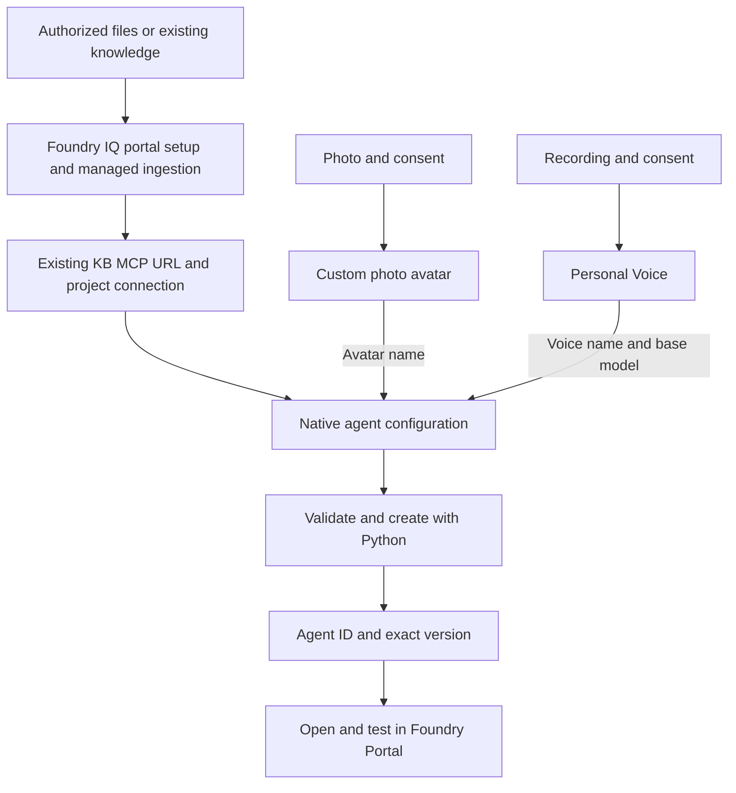

# Create a Foundry agent with Knowledge IQ, custom photo avatar, and Personal Voice

Prepare Knowledge and consent-based personal assets in the portal, create a native agent with Python, and open it in **Foundry Portal**. The creator needs no local UI, microphone library, hosted container, or browser proxy.

> **Validation status:** the sample owner confirmed completing the Knowledge + Personal Voice + custom photo-avatar workflow in Foundry. Automated SDK/CLI checks and manual acceptance are recorded separately in [evaluation methods and results](docs/evaluation.md).

## Workflow and outputs



| Step | Output to retain locally | Check before continuing |
| --- | --- | --- |
| Prepare Foundry | Project endpoint and model choice | Correct project, region and access |
| Prepare Knowledge | KB MCP URL and RemoteTool project connection name | Ingestion completes and retrieval finds the source content |
| Create photo avatar | Custom photo-avatar name | Consent accepted, creation succeeds and preview shows the expected likeness |
| Create Personal Voice | Runtime voice name and base model | Creation succeeds and the selected voice works in preview |
| Create agent | Agent ID, name, version ID and exact version | Read-back matches the requested configuration |
| Open Portal | The same agent in the same project | Knowledge, voice and avatar work together |

Obtain approval for the destination, cost and permissions before uploading documents or personal media. Keep credentials, consent media, real resource/asset identifiers and local output out of Git.

## 1. Prepare Foundry and install the creator

Use a Foundry project, not a hub-based project. Follow [subscription setup](../../setup_subscription.md) if a project is not already available.

- `project_endpoint`: `https://<account>.services.ai.azure.com/api/projects/<project>`, not the project's ARM resource ID.
- `model_type="managed"`: a service-managed model such as `gpt-realtime`.
- `model_type="self_deployed"`: `model` names a deployment in your project.

Confirm that the resource and region support the chosen Personal Voice and photo-avatar capabilities. Native voice agents are preview.

### Permissions

| Identity | Access needed |
| --- | --- |
| Creator | Foundry User on the appropriate Foundry scope to create/read agents |
| Connection administrator | Foundry Project Manager, or equivalent connection-write access, if a new connection is needed |
| Foundry project's managed identity | Search Index Data Reader on the Search service for runtime retrieval |
| Knowledge administrator | Source, storage, Search and model access required by the selected ingestion workflow |

An existing KB and connection can be reused without granting the creator index-management or document-upload permissions. For a new managed source, follow the [portal setup guide](https://learn.microsoft.com/en-us/azure/search/get-started-portal-agentic-retrieval) for its identities, model deployments and roles. Do not assume all portal configurations use the same resources or retrieval settings. Allow time for role assignments to propagate.

### Dependencies

Use an isolated environment; the recorded run uses Python 3.13 in WSL Ubuntu. In WSL, open this repository through its `/mnt/c/...` path. From `VoiceAgent`, choose an unused environment path:

```bash
VENV="$HOME/.venvs/create-agent-with-iq-avatar-voice"
if [ -e "$VENV" ] || [ -L "$VENV" ]; then
  printf '%s\n' 'Choose a new environment path; do not overwrite an existing environment.'
else
  python3.13 -m venv "$VENV" &&
  env -u PIP_EXTRA_INDEX_URL -u PIP_INDEX_URL PIP_CONFIG_FILE=/dev/null \
    "$VENV/bin/python" -m pip install --index-url https://pypi.org/simple \
    -r samples/create-agent-with-iq-avatar-voice/requirements.txt
fi
```

After successful installation:

```bash
source "$VENV/bin/activate"
python -m pip check
cd samples/create-agent-with-iq-avatar-voice
python -c 'import create_agent; create_agent.require_sdk()'
python create_agent.py --help
```

For an existing verified installation, activate its environment and skip creation/install. The requirements use the **bundled** `azure-ai-projects` 2.7.0b1 build, not an arbitrary package with the same version. Its source and checksum are in [dist/README.md](../../dist/README.md). No `[realtime]` extra, PyAudio or Voice Live SDK is needed. Transitive dependencies resolve from the wheel's metadata.

Sign in through Azure CLI or another supported `DefaultAzureCredential` identity before cloud commands. `validate` needs neither credentials nor network access. The CLI does not load or rewrite `.env` files.

## 2. Prepare Knowledge in the portal

[Foundry IQ](https://learn.microsoft.com/en-us/azure/foundry/agents/concepts/what-is-foundry-iq) provides reusable knowledge bases. Use the portal to prepare or select one; Python does not require you to manually split documents or build a Search index.

### Create or reuse a knowledge base

1. Open [Foundry Portal](https://ai.azure.com/), select the project and use the **New Foundry** experience.
2. Select **Build → Knowledge**. Reuse an existing Foundry IQ knowledge base when available; do not re-upload its files or recreate its index for this sample.
3. For a new KB, create or connect to a suitable Search service and add a knowledge source using the portal workflow. Choose an indexed source with **managed ingestion**, such as Azure Blob Storage. For local files, upload them to the selected storage container through **Azure portal → Storage account → Data storage → Containers → Upload**. The [portal walkthrough](https://learn.microsoft.com/en-us/azure/search/get-started-portal-agentic-retrieval) covers creating a blob knowledge source and KB without writing index definitions.
4. Complete any embedding/model and identity settings requested by the chosen workflow. Managed ingestion handles parsing, chunking and indexing; you do not implement those steps in this sample. Wait for ingestion to complete and resolve reported failures before testing.
5. Test a question supported by the documents in the Knowledge playground and inspect the returned references. Also test a question outside the corpus. Before agent creation, ensure the KB and project connection described below are ready.

For a public starting corpus, use the complete [voice-agent overview](../sample_foundry_iq_doc/voice-agent-overview.md). For your own content, check usage rights, remove duplicated or unreadable material, preserve useful source references and avoid uploading evaluation answers as knowledge. Keep the document set unchanged during a test run.

### Reuse the connection in Python

This creator consumes **Foundry IQ's Search KB MCP endpoint**. The high-level setup still needs to hand off two configuration values:

| Creator field | Value and source |
| --- | --- |
| `definition.tools[0].server_url` | The KB MCP endpoint from the existing KB integration configuration or the corresponding RemoteTool connection's `target` |
| `definition.tools[0].project_connection_id` | That **project RemoteTool connection's name**, not its ARM ID, a KB name or an ordinary Azure AI Search connection name |

Read the existing configuration through the available portal details or supported management API; do not copy credentials. If the project MCP connection does not exist, complete the official [Connect agents to Foundry IQ](https://learn.microsoft.com/en-us/azure/foundry/agents/how-to/foundry-iq-connect#create-a-project-connection) setup once. Use the project's managed identity with Search read access, confirm the connection target and audience, and reuse it here. The creator does not provision or replace the connection.

The current template accepts this endpoint shape and Search API version:

```text
https://<search-service>.search.windows.net/knowledgebases/<knowledge-base>/mcp?api-version=2026-08-01-preview
```

The official [connection guide](https://learn.microsoft.com/en-us/azure/foundry/agents/how-to/foundry-iq-connect#required-values) identifies the Search service endpoint and KB name used in this URL. Confirm compatibility with the existing integration; do not rewrite a different API version or append tokens/SAS parameters merely to pass local validation.

**Scope:** a portal's **Files**, `file_search`, or Toolbox upload flow is not automatically the same as this IQ MCP integration. Those identifiers cannot be pasted into this template. This sample reuses `knowledge_base_retrieve` through the specified KB connection; it does not add another knowledge backend or require a second upload when that integration already exists.

## 3. Create your photo avatar

Use your own likeness or a person whose explicit authorization and required consent you hold.

1. Confirm access and regional support using the [custom photo-avatar guide](https://learn.microsoft.com/en-us/azure/ai-services/speech-service/text-to-speech-avatar/custom-photo-avatar-create).
2. Prepare a clear, forward-facing photo and the prescribed **consent video from the same person**. Follow the official consent statement and recording requirements.
3. In the documented Foundry workflow, open **Build → Fine-tune → AI Services → Fine-tune → Azure Speech - Text to Speech Avatar → Photo avatar**. Use the linked guide if labels differ.
4. Upload/select the photo and consent, review the acknowledgement and submit. Wait for **Succeeded**.
5. Retain the created **custom photo-avatar name** for `avatar.character`. Use **Try Voice Live / Open in Playground** to check the expected likeness and resource association.

This sample uses `photo_avatar` with `customized=true` and `model="vasa-1"`; it does not train a video avatar. The agent JSON references the created name, not a source-photo URL. Standalone asset preview and testing that asset in the created agent are separate checks.

## 4. Create your Personal Voice

Personal Voice is the only custom-voice workflow in this sample. Prebuilt standard voices remain available as a baseline.

1. Confirm resource access and follow [Create a Personal Voice project](https://learn.microsoft.com/en-us/azure/ai-services/speech-service/personal-voice-create-project): **Fine-tuning → AI Service → Fine-tune → Azure Speech - Text to Speech**, with **Type: Personal voice**.
2. Continue to **Register voice talent** and [register consent](https://learn.microsoft.com/en-us/azure/ai-services/speech-service/personal-voice-create-consent) from the actual speaker. Use the required statement and wait for successful processing.
3. On **Training data**, select **Upload data** or **Record data**. Supply a clean, single-speaker **5–90-second** recording and submit it using the [portal instructions](https://learn.microsoft.com/en-us/azure/ai-services/speech-service/personal-voice-create-voice).
4. After successful processing, select **Fine-tuning → AI Service → your task → Open in Playground** and test synthesis.
5. In supported Voice Live tooling for the intended runtime resource, select and preview the created voice. Retain its **Personal Voice runtime name** for `audio.output.voice` and choose the supported synthesis base model, `DragonLatestNeural` or `DragonHDOmniLatestNeural`, for `personal_voice_model`.

Keep consent IDs, management `personalVoiceId` and `speakerProfileId` separate from the runtime name. A returned profile ID alone does not establish the Voice Live name, and it is never the base-model value. Resolve the runtime selection through supported tooling rather than guessing or automatically converting IDs. The [Voice Live customization guide](https://learn.microsoft.com/en-us/azure/ai-services/speech-service/voice-live-how-to-customize) describes its name/model fields; the native mapping is below.

## 5. Configure Knowledge, voice and photo avatar

For all three capabilities together, copy [agent.personal.example.json](agent.personal.example.json) to an ignored local file and replace every placeholder:

```bash
cp agent.personal.example.json agent.personal.local.json
python create_agent.py validate --config agent.personal.local.json
```

PowerShell users can use `Copy-Item`. Unchanged templates intentionally fail validation. Keep the local configuration private and do not add credentials.

| Field | Meaning |
| --- | --- |
| `project_endpoint` | Foundry project data-plane endpoint |
| `agent_name` | A fresh name; existing agents are not overwritten or versioned implicitly |
| `definition.kind` | `voice`, not `prompt` or `hosted` |
| `model_type` / `model` | Managed model or self-deployed project deployment |
| MCP `server_url` / `project_connection_id` | The KB MCP URL and project connection name from step 2 |
| `allowed_tools` | Only `knowledge_base_retrieve` |
| `audio.output.voice_type` | `azure-personal` |
| `audio.output.voice` | Personal Voice runtime name (Voice Live `voice.name`) |
| `audio.output.personal_voice_model` | Synthesis base model (Voice Live `voice.model`) |
| `avatar.type` | Native `photo_avatar` with an underscore, not the public wire spelling `photo-avatar` |
| `avatar.character` | Created custom photo-avatar name |
| `avatar.customized` / `avatar.model` | `true` / `vasa-1` |
| `avatar.output_protocol` | Explicit `webrtc` or `websocket`; the template selects `webrtc` |
| `store` | Explicitly `false` in the templates; enable storage only after deciding retention and access |

Use the native field names from the [bundled SDK](../../dist/README.md), not a public Voice Live `session.update` object. Keep instructions requiring retrieval for factual questions, source references and an honest unknown answer when the corpus does not support a claim.

The creator also supports isolated checks, retaining Knowledge in every configuration:

| Configuration | Template and changes | `output_modalities` |
| --- | --- | --- |
| Standard voice, no avatar | Use [agent.example.json](agent.example.json) | `["text", "audio"]` |
| Personal Voice, no avatar | Remove the personal template's entire `avatar` object | `["text", "audio"]` |
| Standard voice + custom photo | Set standard voice/type and remove `personal_voice_model` | `["text", "audio", "avatar"]` |
| Personal Voice + custom photo | Use `agent.personal.example.json` | `["text", "audio", "avatar"]` |

For the standard baseline, copy `agent.example.json` to `agent.local.json` and validate that file instead. Select the protocol supported by the intended interaction surface; accepting both enum values is not a live compatibility matrix.

Local validation checks fields, not consent, resource access or actual asset availability. Unknown fields and unsupported settings are rejected. There is no asset-ID conversion, bypass or silent fallback to standard assets.

## 6. Create in code and read back identifiers

Review the selected configuration and obtain approval before creating the named agent. Run only the scenario you intend to use:

```bash
mkdir -p local-output
python create_agent.py create --config agent.personal.local.json --output local-output/personal-agent.json
```

The creator:

1. Validates locally and checks that the agent name does not exist. Do not run concurrent creators for the same name; this preflight is not an atomic name reservation.
2. Calls `AIProjectClient(..., allow_preview=True).agents.create_version(...)` once, without automatic retries.
3. Reads the returned **exact version** and agent details, comparing requested model, Knowledge, voice, avatar and output settings with the saved definition.
4. Prints the service-issued `agent_id`, `agent_name`, `version_id`, `version`, optional `agent_guid`, `state` and `agent_endpoint`. Agent ID and version ID are distinct; missing values are not invented. Definition hashes are diagnostics, not a requirement that service-added defaults be absent.

Inspect the same version without creating another:

```bash
python create_agent.py show --config agent.personal.local.json --version "<returned-version>"
```

For the standard baseline, use `agent.local.json` and a different output filename. Keep the configuration used for the exact version: `show` compares against it and rejects `latest`. Existing output files are never overwritten.

On partial failure, inspect the reported name/version before retrying: creation may have succeeded even if verification failed. The CLI does not delete agents, provision Knowledge, assign roles, upload assets or enable disabled agents. Read-back verifies stored settings, not runtime playback.

## 7. Open the agent in Foundry Portal

1. Open [Foundry Portal](https://ai.azure.com/) and select the **same project** as `project_endpoint`.
2. Open the agent list, locate the returned `agent_name`, and compare the agent ID and exact version with the creator's report wherever displayed. Retain the read-back report for fields the UI does not expose.
3. Inspect the saved model, voice, photo avatar and Knowledge connection. If the agent is disabled, review its state and explicitly enable it through supported management tooling.
4. Open that native agent's available voice interaction surface, grant microphone permission and test a document-supported question and an unsupported question.
5. Check the selected voice, likeness, playback, synchronization and interruption. Record any unavailable surface or unsupported combination rather than substituting a model playground.

The owner has confirmed the complete workflow in Foundry. See the [result summary](docs/evaluation.md) for that manual acceptance and the separate automated checks.

## 8. Evaluate and clean up

[Evaluation methods and results](docs/evaluation.md) contains the test summary, scoring guidance and known limits. Per-question answers or recordings are not required in the public sample.

Run offline checks from this directory:

```bash
python -m unittest -v test_create_agent.py
python create_agent.py --help
```

Tests use the actual bundled SDK with fake credentials and in-memory HTTP responses; no Azure request or microphone access is needed.

For cleanup, review the agent/version created for this sample. Remove only explicitly approved resources through supported interfaces. **Do not delete a reused KB, connection, storage container or personal asset** just because the sample is finished. Removing an agent does not remove its dependencies. Follow the applicable retention policy for consent and biometric data.

## Troubleshooting

| Symptom | Check |
| --- | --- |
| Placeholder/unknown field rejected | Complete the native template; do not paste a different agent or Voice Live wire configuration |
| Knowledge configuration rejected | Use the supported IQ KB MCP URL/API version and RemoteTool connection name, not File Search or Toolbox identifiers |
| Knowledge returns nothing | Managed ingestion status, selected source/corpus and the KB retrieval test |
| Knowledge 401/403 | Project identity, Search reader role and connection scope/target/audience |
| Personal Voice/photo avatar fails | Consent, runtime names, resource/region access and standalone preview |
| Agent already exists | Inspect its exact version or choose a genuinely new name |
| Create/read-back 401/403 | Identity, project access and preview availability |
| Model not found | Managed versus self-deployed selection and regional availability |
| Portal surface missing | Record the limitation; successful configuration read-back is not playback evidence |

## Sources

- [Bundled SDK source](https://github.com/Azure/azure-sdk-for-python/tree/f84c5330f4246892455f33fccdf9503a774ecf66/sdk/ai/azure-ai-projects)
- [Foundry IQ overview and portal workflow](https://learn.microsoft.com/en-us/azure/foundry/agents/concepts/what-is-foundry-iq)
- [Portal managed-ingestion walkthrough](https://learn.microsoft.com/en-us/azure/search/get-started-portal-agentic-retrieval)
- [Foundry IQ project connection](https://learn.microsoft.com/en-us/azure/foundry/agents/how-to/foundry-iq-connect)
- [Photo-avatar creation](https://learn.microsoft.com/en-us/azure/ai-services/speech-service/text-to-speech-avatar/custom-photo-avatar-create)
- [Personal Voice creation and preview](https://learn.microsoft.com/en-us/azure/ai-services/speech-service/personal-voice-create-voice)
- [Voice Live personal-voice configuration](https://learn.microsoft.com/en-us/azure/ai-services/speech-service/voice-live-how-to-customize)
