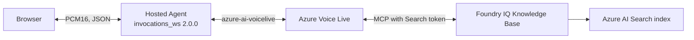

<!-- Begin standard disclaimer — do not modify -->
**IMPORTANT!** All samples and other resources made available in this GitHub repository ("samples") are designed to assist in accelerating development of agents, solutions, and agent workflows for various scenarios. Review all provided resources and carefully test output behavior in the context of your use case. AI responses may be inaccurate and AI actions should be monitored with human oversight. Learn more in the transparency note for [Agent Service](https://learn.microsoft.com/en-us/azure/ai-foundry/responsible-ai/agents/transparency-note).

Agents, solutions, or other output you create may be subject to legal and regulatory requirements, may require licenses, or may not be suitable for all industries, scenarios, or use cases. By using any sample, you are acknowledging that any output created using those samples are solely your responsibility, and that you will comply with all applicable laws, regulations, and relevant safety standards, terms of service, and codes of conduct.

Third-party samples contained in this folder are subject to their own designated terms, and they have not been tested or verified by Microsoft or its affiliates.

Microsoft has no responsibility to you or others with respect to any of these samples or any resulting output.
<!-- End standard disclaimer -->

# Voice Live with Foundry IQ (`invocations_ws`)

This sample deploys a Microsoft Foundry hosted agent that bridges the public `invocations_ws` 2.0 protocol to Azure Voice Live. Voice Live calls a Foundry IQ knowledge base over MCP and streams grounded speech and text to a browser using an Azure standard voice.

This standalone sample uses the public Azure Voice Live SDK and its own Python 3.13 dependencies, not the bundled preview Projects SDK used by other samples in this directory. Follow this README rather than the parent directory's Projects SDK setup.

The implementation extends the official [`invocations_ws/hello-world`](https://github.com/microsoft-foundry/foundry-samples/tree/main/samples/python/hosted-agents/bring-your-own/invocations_ws/hello-world) sample without adding an orchestration framework or a second protocol.

> [!WARNING]
> Local knowledge-answer and unknown-answer tests have passed. Avatar is an experimental opt-in: service transport tests have passed, and local manual browser validation has passed with Ava and automatic greeting enabled, covering playback, audio/video synchronization, and interruption. These checks do not establish cross-browser or long-running reliability. Hosted deployment and cloud E2E validation have not been completed.

## What the sample demonstrates

- A Python hosted agent using `InvocationAgentServerHost` and `@app.ws_handler`.
- Bidirectional PCM16 audio at 24 kHz and text input over one browser WebSocket.
- Foundry IQ grounding through the `knowledge_base_retrieve` MCP tool.
- Azure standard voice with interruptible PCM playback by default.
- Experimental built-in Avatar output, explicitly enabled when needed.
- A small, replaceable, original knowledge corpus and an idempotent provisioner.

## Architecture



The agent obtains an Entra token for `https://search.azure.com/.default` and supplies it only to the Voice Live MCP configuration. The browser never receives this token. Because the MCP authorization is fixed when a Voice Live session is created, the agent closes the browser connection five minutes before that token expires; reconnecting creates a session with a fresh token.

Text turns, committed audio turns, and MCP continuations share one serialized response coordinator. Voice activity detection commits audio without automatically creating a response, so the coordinator is the only `response.create()` path. When a response invokes MCP, the bridge waits until every call reaches a terminal state, requests one continuation, suppresses intermediate `response_done` events, and forwards only the final successful completion. Cancelled or failed chains are cleaned up so late MCP events cannot restart them.

## Files

| File | Purpose |
| --- | --- |
| [`azure.yaml`](azure.yaml) | Hosted-agent manifest and post-provision hook. |
| [`main.py`](src/voice-live-foundry-iq-avatar/main.py) | Browser-to-Voice-Live bridge and session configuration. |
| [`provision_kb.py`](src/voice-live-foundry-iq-avatar/provision_kb.py) | Creates the Search index, knowledge source, and knowledge base. |
| [`knowledge/documents.json`](src/voice-live-foundry-iq-avatar/knowledge/documents.json) | Small original “Earth at night” corpus. |
| [`chat_client/index.html`](src/voice-live-foundry-iq-avatar/chat_client/index.html) | Microphone, transcript, PCM playback, and MCP status UI. |
| [`chat_client/proxy.py`](src/voice-live-foundry-iq-avatar/chat_client/proxy.py) | Loopback-only proxy for browser access to a deployed agent. |
| [`e2e_local.py`](src/voice-live-foundry-iq-avatar/e2e_local.py) | Headless grounded-answer, MCP, and audio smoke test. |

## Prerequisites

1. Python 3.13.
2. Azure CLI and Azure Developer CLI (`azd`) 1.27.1 or later.
3. The Microsoft Foundry `azd` extension:

   ```bash
   azd ext install microsoft.foundry
   ```

4. A Foundry project with a Voice Live-compatible realtime model deployment.
5. An Azure AI Search service with RBAC access enabled.

### Required RBAC

| Identity | Role | Scope | Purpose |
| --- | --- | --- | --- |
| Local user | **Foundry User** | Foundry account | Open the Voice Live session locally. |
| Local user | **Search Service Contributor** | Search service | Create the index, knowledge source, and knowledge base. |
| Local user | **Search Index Data Contributor** | Search service | Upload the sample documents. |
| Hosted-agent managed identity | **Foundry User** | Foundry account | Open Voice Live after deployment. |
| Hosted-agent managed identity | **Search Index Data Reader** | Search service | Retrieve from the knowledge base after deployment. |

Role assignments can take several minutes to propagate.

## Initialize and configure

```bash
mkdir my-voice-live-iq-agent && cd my-voice-live-iq-agent

azd ai agent init \
  -m https://github.com/Azure-Samples/Cognitive-Speech-TTS/blob/master/VoiceAgent/samples/voice-live-foundry-iq-avatar/azure.yaml

azd auth login
az login
azd env set AZURE_VOICELIVE_MODEL "<realtime-model-deployment>"
azd env set AZURE_SEARCH_ENDPOINT "https://<search-service>.search.windows.net"
```

The URL above targets the merged `master` version. To test an unmerged contribution, use its actual branch URL for `-m`, or run the checked-out sample directly with the local configuration described below.

For **Knowledge + Avatar + Voice** together, enable Avatar before starting the agent:

```bash
azd env set AZURE_VOICELIVE_ENABLE_AVATAR true
azd env set AZURE_VOICELIVE_VOICE "en-US-Ava:DragonHDLatestNeural"
```

The default greeting is enabled. After provisioning, follow **Run locally** and **Browser test**. For a direct Python launch, use the same variables in the process environment or runtime `.env` instead of `azd env set`.

## Provision the knowledge base

```bash
azd provision
```

The manifest also defines `azd up` as two ordered steps—`azd provision` followed by `azd deploy --all`—so the MCP endpoint written by provisioning is available to the deployment process.

The post-provision hook installs the pinned runtime requirements, then creates or updates:

- `voice-live-night-index`
- `voice-live-night-source`
- `voice-live-night-kb`

The default knowledge base uses `extractiveData` output with `minimal` retrieval reasoning effort, so it doesn't require a separate knowledge-base LLM. These settings and the MCP endpoint use the preview `2026-08-01-preview` Search API and aren't covered by a service-level agreement. The hook stores the MCP URL as `KB_MCP_ENDPOINT` in the active `azd` environment.

To choose different resource names before provisioning:

```bash
azd env set AZURE_SEARCH_INDEX_NAME "my-sample-index"
azd env set KNOWLEDGE_SOURCE_NAME "my-sample-source"
azd env set KNOWLEDGE_BASE_NAME "my-sample-kb"
```

## Run locally

From the generated project directory that contains `azure.yaml`:

```bash
python -m venv .venv
source .venv/bin/activate
python -m pip install \
  -r src/voice-live-foundry-iq-avatar/requirements.txt \
  -r src/voice-live-foundry-iq-avatar/requirements-dev.txt
azd ai agent run
```

On Windows PowerShell, activate with `.venv\Scripts\Activate.ps1`. To run without `azd`, copy `.env.example` to `.env`, fill in its values, change to `src/voice-live-foundry-iq-avatar`, and run `python main.py`.

### Local automated validation

From `src/voice-live-foundry-iq-avatar` after installing both requirement files:

```bash
python -m py_compile main.py provision_kb.py e2e_local.py chat_client/proxy.py
python -m pytest -q
```

These checks do not connect to Azure or prove that audio plays in a browser. Complete the following live tests separately.

### Headless end-to-end test

In another terminal:

```bash
python src/voice-live-foundry-iq-avatar/e2e_local.py
```

The default question is answerable from the bundled corpus. The test requires:

- a ready Voice Live session;
- one completed Knowledge MCP call;
- the expected grounded text;
- nonzero PCM audio; and
- `response_done` with no error.

When a greeting is pending, the test waits for its completion before sending the knowledge question. Greeting text and media do not count toward the answer checks. The printed timestamps are diagnostics, not service-level objectives.

### Browser test

Serve the browser client from a second terminal:

```bash
cd src/voice-live-foundry-iq-avatar/chat_client
python -m http.server 8080
```

Open <http://localhost:8080/>, select **Start mic + connect**, and permit microphone access. The default URL is `ws://localhost:8088/invocations_ws`.

Verify a known question produces a grounded spoken answer, an unknown question is acknowledged as unknown, and speaking during an answer interrupts playback.

## Deploy and test

```bash
azd deploy voice-live-foundry-iq-avatar
```

After deployment, grant the hosted agent's managed identity **Foundry User** at the Foundry account scope and **Search Index Data Reader** at the Search service scope. Retrieve its principal ID from the Foundry portal or deployment output, then assign the roles:

```bash
az role assignment create \
  --assignee-object-id "<agent-principal-id>" \
  --assignee-principal-type ServicePrincipal \
  --role "Foundry User" \
  --scope "/subscriptions/<subscription>/resourceGroups/<resource-group>/providers/Microsoft.CognitiveServices/accounts/<account>"

SEARCH_ID=$(az search service show \
  --name "<search-service>" \
  --resource-group "<resource-group>" \
  --query id -o tsv)
az role assignment create \
  --assignee-object-id "<agent-principal-id>" \
  --assignee-principal-type ServicePrincipal \
  --role "Search Index Data Reader" \
  --scope "$SEARCH_ID"
```

Run the headless test against the deployed endpoint:

```bash
python src/voice-live-foundry-iq-avatar/e2e_local.py \
  --foundry "https://<account>.services.ai.azure.com/api/projects/<project>" \
  --agent voice-live-foundry-iq-avatar
```

For a browser test, browsers cannot set the Foundry WebSocket authorization header. Run the bundled loopback proxy:

```bash
python src/voice-live-foundry-iq-avatar/chat_client/proxy.py \
  --foundry "https://<account>.services.ai.azure.com/api/projects/<project>" \
  --agent voice-live-foundry-iq-avatar
```

Then open <http://localhost:8765/>. Do not expose this development proxy on a public interface.

## Use your own knowledge

Each document must contain nonempty `id`, `title`, `content`, and `source_url` strings. Either replace [`documents.json`](src/voice-live-foundry-iq-avatar/knowledge/documents.json), or keep it unchanged and point to another local file:

```bash
azd env set KNOWLEDGE_DOCUMENTS_PATH "/absolute/path/to/documents.json"
azd provision
```

Provisioning first performs a read-only preflight of the selected index. This intentionally small-corpus sample supports at most 1,000 input documents and refuses an existing index with more than 1,000 documents before issuing any write. It then creates or updates the index, uploads the complete current corpus, and deletes stale IDs only after every upload succeeds. Use a dedicated index and different index, source, and knowledge-base names when corpora should coexist rather than replace one another. For PDFs, extract or OCR the body text first, remove duplicated OCR layers, page headers, footers, tables of contents, indexes, and blank pages, and preserve useful title, section, and source metadata. Only ingest content that is authorized for this use.

## Standard voice

The default instructions request English for both spoken and text responses, switching languages only when the user explicitly asks. This is separate from the voice selection. A nonempty `AZURE_VOICELIVE_INSTRUCTIONS` overrides the default instructions, including the language and grounding rules.

The default Azure standard voice is `en-US-Ava:DragonHDLatestNeural`. To choose another standard voice:

```bash
azd env set AZURE_VOICELIVE_VOICE "<standard-voice-name>"
```

For example, use the prebuilt multilingual Andrew voice without uploading recordings or training a voice:

```bash
azd env set AZURE_VOICELIVE_VOICE "en-US-AndrewMultilingualNeural"
```

Restart the agent and reconnect the browser to apply the change. For a direct `python main.py` launch, set the same variable in the process environment instead. This selects an Azure standard voice, not a Custom Voice or Personal Voice; the sample does not create or manage voice assets. The same voice setting applies with or without Avatar.

## Automatic greeting

Each new connection greets once after the Voice Live session and Knowledge MCP tools are ready. The default text is `Hello! I'm your AI knowledge assistant. How can I help you today?`. If the user sends text or starts speaking before the greeting begins, the pending greeting is skipped. Silent microphone frames do not suppress it.

The greeting uses a pre-generated assistant message and the configured voice, with or without Avatar. It does not call the knowledge base; subsequent user questions still use Knowledge MCP.

To customize the greeting:

```bash
azd env set AZURE_VOICELIVE_GREETING "Hello! How can I help you today?"
```

To disable it, set an explicit empty value:

```bash
azd env set AZURE_VOICELIVE_GREETING ""
```

Restart the agent and reconnect the browser after changing the configuration. For a direct `python main.py` launch, set the same variable in the process environment or local `.env`. An unset variable uses the default greeting; an empty value disables it. Check the greeting's playback and interruption in the browser when validating this feature.

## Experimental Avatar

Avatar is disabled by default. To try the built-in Lisa / `casual-sitting` Avatar with the configured standard voice:

```bash
azd env set AZURE_VOICELIVE_ENABLE_AVATAR true
```

Restart the agent and refresh the browser client. For a manual `python main.py` launch, set `AZURE_VOICELIVE_ENABLE_AVATAR=true` in the environment or local `.env` instead. Video and its audio track arrive together as fMP4 over the existing WebSocket; the browser plays that media rather than playing PCM a second time. Audit PCM output is not enabled.

Run the explicit Avatar transport check:

```bash
python src/voice-live-foundry-iq-avatar/e2e_local.py --require-avatar --timeout 150
```

This requires the Knowledge MCP call, expected final answer text, video bytes, and successful response completion with no error. It does not require separate PCM bytes and does not prove that the video contains an audible, synchronized answer; idle video alone is insufficient.

Manually verify a known answer has audible speech and matching lip movement, an unknown question is acknowledged as unknown, microphone questions work, and stop/reconnect starts a fresh session. Repeat these checks after changing the voice or browser. Local manual Avatar validation passed with Ava and automatic greeting enabled, including playback, audio/video synchronization, and interruption. Interruption remains best-effort: media fragments do not carry a response ID, so late fragments after cancellation cannot be reliably attributed to an old response.

To return to the default Knowledge-only mode, set `AZURE_VOICELIVE_ENABLE_AVATAR=false` and restart. The default headless test remains unchanged and does not require video support.

## Browser wire protocol

| Direction | Frame | Payload |
| --- | --- | --- |
| Browser → Agent | Binary | Raw PCM16, 24 kHz, mono. |
| Browser → Agent | JSON | `{"type":"text","content":"..."}`. |
| Agent → Browser | Binary | 8-byte little-endian sample rate/channel header followed by PCM16. |
| Agent → Browser | JSON | Session, speech, transcript, MCP, response, and error events. |
| Agent → Browser, Avatar enabled | JSON | `{"type":"video_data","delta":"<base64-fMP4>","codec":"h264"}`; media includes the audio track. |

`session_started.greeting_pending` indicates whether the initial greeting is pending. Its completion uses the existing `response_done` event with `kind: "greeting"` and a `status` field. The headless test uses these fields to finish the greeting phase before sending and measuring the knowledge question.

## Troubleshooting

- **Voice Live returns 401/403:** verify `Foundry User` is assigned at the account scope to the active local identity or hosted-agent identity.
- **Knowledge MCP returns 401/403:** verify `Search Index Data Reader` for runtime retrieval and the two contributor roles for provisioning.
- **The MCP endpoint is missing:** run `azd provision`, or set `KB_MCP_ENDPOINT` directly. The provisioning hook fails if it cannot persist this value in the active azd environment.
- **The browser asks to reconnect:** the static Search bearer token is nearing expiry. Start a new browser connection to create a Voice Live session with fresh authorization.
- **The browser cannot connect to Foundry:** use `chat_client/proxy.py`; a browser WebSocket cannot supply the required authorization header directly.

## Cleanup

`azd down` removes resources managed by the generated Foundry environment, but it does not automatically delete artifacts created inside an existing Search service. In the Search portal, review and explicitly delete only the sample knowledge base, knowledge source, and index names configured above. Do not delete an existing Search service or unrelated user data.

## Related documentation

- [Build a voice agent](https://learn.microsoft.com/azure/foundry/agents/how-to/build-voice-agent)
- [Voice Live MCP server integration](https://learn.microsoft.com/azure/ai-services/speech-service/how-to-voice-live-mcp-server)
- [Connect agents to Foundry IQ](https://learn.microsoft.com/azure/foundry/agents/how-to/foundry-iq-connect)
- [Hosted agents](https://learn.microsoft.com/azure/foundry/agents/concepts/hosted-agents)
